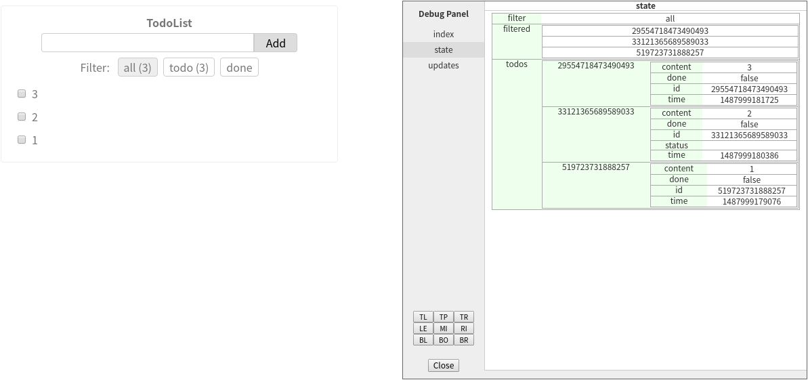
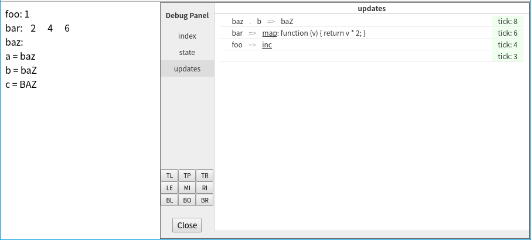
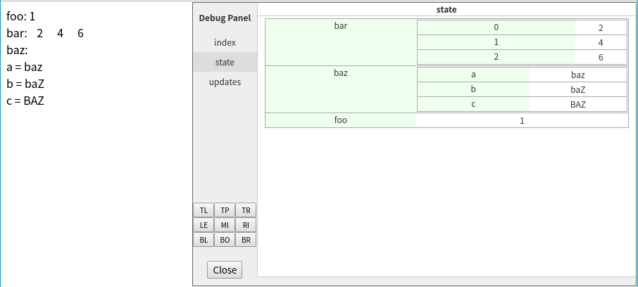

[](https://badge.fury.io/js/affjs)
[](https://travis-ci.org/reusee/aff)
[](https://coveralls.io/github/reusee/aff?branch=master)

## 目录

* [概述](#summary)
* [代码示例](#demo)
* [环境安装与配置](#installation)
* [App 类](#app)
* [html 标签的表示](#tags)
* [组件与组件状态](#component)
* [组件函数调用的优化](#thunk)
* [全局状态](#state)
* [状态的更新](#update)
* [状态对象的 $update 方法](#state-object-update)
* [组件状态的传递](#state-passing)
* [默认状态及衍生状态](#default-and-derived-state)
* [代码复用](#reusable)
* [路由](#routing)
* [调试面板](#debug-panel)
* [异步竞态问题](#async-race)
* [代码示例：todomvc 和 dbmon](#todomvc-and-dbmon)

<h2 id="summary">概述</h2>

这个前端框架是由 react + redux 的理念发展而成，但也有一些显著的差异：

* 使用 js 函数来表达结构，而不是 JSX，也不是 html 模板或者 hyper-script 类。在表达效率上比较高。
* 不仅结构用 js 表达，样式、逻辑等都用 js，也就是源码都是纯 js 代码，没有专用格式的文件。
所以分支、循环等逻辑，都直接用 js 自身的语言特性实现，不需要特殊的标签或者指令。
* 集成了状态管理机制，而不是交给第三方库。
和 redux 一样使用全局状态，但不使用不可变数据结构，且实现了高效的变动检测，另外概念和代码都比 redux 简洁。

如有任何意见、建议、提问、讨论等，请在 issues 处发表。任何相关的内容都可以，语言中英皆可。

<h2 id="demo">代码示例</h2>

介绍一个框架，用实际的实例代码，应该是最直观的。

这个示例要实现的是，一个任务列表。
可以增加、展示、编辑、删除任务，以及标记为完成或未完成、按照完成状态过滤列表等等：



这个框架提供的绝大部分特性，都会使用到，以达到示例的目的。
代码只做简单的注释，各种机制将会在后续的章节里讲述。

```js
import 'normalize.css'
import 'animate.css'
import Navigo from 'navigo'

import { App, css, t, on, key, $, ref, weakRef, h, op, DebugPanel } from 'affjs'

// 读保存在 local storage 里的状态
const saved = JSON.parse(window.localStorage.getItem('todos-data')) || {};
// 初始状态树
const initState = {
  // 任务信息
  todos: saved.todos || {},
  // 过滤器
  filter: saved.filter || 'all',
  // 过滤后的任务ID列表
  filtered: [],

  // 下面都是传递给组件的状态，属性名和组件名一样

  NewTodo: {
    todos: weakRef('todos'),
  },

  MaintainFiltered: {
    // 引用 todos 和 filter 状态
    todos: ref('todos'),
    filter: ref('filter'),
    filtered: weakRef('filtered'),
  },

  Filter: {
    todos: ref('todos'),
    filter: ref('filter'),
  },

  List: {
    todos: ref('todos'),
    ids: ref('filtered'),
    hovering: '',

    // 嵌套的组件，对应有一个嵌套的状态
    Item: {
      hovering: weakRef('hovering'),
      todos: weakRef('todos'),

      ItemControl: {
        // 这个组件没有初始状态，但也留着这个备用
        // 在需要增加初始状态的时候，可以直接添加
      },
    },
  },

  DebugPanel: {
    show: true,
    left: '50%',
  },

};

// 根组件，传入的 state 就是上面定义的对象
function Main(state, app) {
  // div 标签，用 h.div 函数表示，标签的各种属性和子标签，用函数参数表示
  return h.div(
    // 表示样式，使用 es6 的模板字符串，加上 css 这个模板标签函数来表示
    css`
      width: 40vw;
      margin: 8px;
      padding: 8px;
      border: 1px solid #EEE;
      border-radius: 4px;
      color: #777;
      text-align: center;
    `,

    // 一个子标签
    h.p('TodoList', css`
      font-size: 16px;
      line-height: 16px;
      font-weight: bold;
      margin: 8px;
    `),

    // 下面是嵌套的子组件，t 函数表示一个 thunk，thunk 是渲染优化的基本单位

    t(NewTodo, state.NewTodo),

    t(MaintainFiltered, state.MaintainFiltered),

    // 因为组件本身就是一个函数，所以可以直接调用，而不需要 t 函数包装
    // 但是就会失去渲染优化，每次渲染根组件，都会重新渲染 Filter 组件
    Filter(state.Filter),

    t(List, state.List),

    // 调试面板，DebugPanel 返回的不是组件，而是参数列表
    DebugPanel(app, state.DebugPanel),

  );
}

// 新建任务组件
function NewTodo(state) {

  // 新建任务，因为有两个地方要用到，所以写成函数
  function addTodo() {
    if (!state.userInput) {
      return
    }
    const id = Math.random().toString().substr(2);
    const content = state.userInput;
    // 更新组件状态，使用状态的 $update 函数，合并一个对象
    state.$update(op.merge({
      updating: true, // 过渡状态
    }));
    // 模拟异步新建操作
    setTimeout(() => {
      // addTodo 是在状态树定义的更新函数
      state.todos.$update(id, {
        id: id,
        time: new Date().getTime(),
        content: content,
        done: false,
      });
      state.$update(op.merge({
        updating: false,
        userInput: '', // 清空输入
      }));
    }, 300);
  }

  return h.div(

    h.input(
      // 标签的属性，用一个 object 表示
      {
        value: state.userInput || '',
        disabled: state.updating,
      }, 
      // 注册 keyup 事件，同步用户输入到 userInput 这个状态
      on('keyup: update input', function() {
        state.$update('userInput', this.element.value);
      }), 
      // 注册 keydown 事件，按下回车时，新建任务
      on('keydown: add todo', (ev) => {
        if (ev.keyCode == 13) {
          addTodo();
        }
      }),
      css`
        width: 64%;
        border-radius: 4px 0 0 4px;
        border: 1px solid #CCC;
        padding: 4px 8px;
      `,
    ),

    // 一个按钮，点击时新建任务
    h.button(
      state.updating ? '...' : 'Add',
      on('click', addTodo),
      css`
        width: 64px;
        border: 1px solid #CCC;
        border-radius: 0 4px 4px 0;
        padding: 4px 8px;
      `,
    ),

    css`
      margin: 8px;
    `,
  );
}

// 维护过滤后的任务ID
function MaintainFiltered(state) {
  // 生成 ID 列表
  const filtered = [];
  for (const id in state.todos) {
    if (state.filter == 'all') {
      filtered.push(id);
    } else if (state.filter == 'done') {
      if (state.todos[id].done) {
        filtered.push(id);
      }
    } else if (state.filter == 'todo') {
      if (!state.todos[id].done) {
        filtered.push(id);
      }
    }
  }

  // 排序
  filtered.sort((a, b) => {
    return state.todos[b].time - state.todos[a].time;
  })
  // 更新状态
  state.filtered = filtered;
  // 这个是功能性组件，没有视觉元素，所以返回 null
  return null;
}

// 任务列表
function List(state) {
  return h.div(
    css`
      margin: 8px;
    `,
    // 遍历 ID 列表，生成各个任务组件
    state.ids.map(id => t(Item, 
      key`item-${id}`,
      state.Item,
      state.todos[id], 
      // hovering
      id == state.hovering,
    )),
  );
}

// 任务组件
function Item(state, info, hovering) { 
  // 更新任务内容的函数
  const saveContent = () => {
    // 模拟异步保存操作
    info.$update('status', 'saving');
    setTimeout(() => {
      info.$update('status', '');
    }, 1000);
  }

  return h.div(
    $`.animated .slideInRight`,
    css`
      text-align: left;
      background-color: ${hovering ? '#EEE' : 'transparent'};
      border-radius: 4px;
      padding: 8px;
      position: relative;
    `,
    on('mouseenter', () => {
      state.hovering = info.id;
    }),
    on('mouseleave', () => {
      state.hovering = '';
    }),

    // 一般状态下，显示一个 checkbox 和任务内容
    info.status != 'editing' ? [
      h.checkbox({
        checked: info.done,
      }, on('click', () => {
        info.$update('done', op.func(v => !v));
      })),
      h.span(info.content, css`
        margin-left: 8px;
        color: ${info.done ? '#AAA' : 'inherit'};
        text-decoration: ${info.done ? 'line-through' : 'none'};
      `),
    ] : null,

    // 编辑时，显示输入框
    info.status == 'editing' ? [
      h.input({
        value: info.content,
      }, on('keyup: update content', function() {
        info.$update('content', this.element.value);
      }), on('keydown: update content and done editing', function(ev) {
        if (ev.keyCode == 13) {
          saveContent();
        }
      }), css`
        border: 0;
        width: 75%;
        background-color: #EFE;
        border-radius: 5px;
        padding: 0 8px;
      `),
    ] : null,

    // 保存或删除过程中，显示提示状态
    info.status == 'saving' || info.status == 'removing' ? h.div(info.status, css`
      width: 100%;
      color: #88F;
      text-align: center;
      background-color: rgba(255, 255, 255, 0.8);
      position: absolute;
      top: 0; left: 0; right: 0; bottom: 0;
      padding: 8px;
    `) : null,

    // 删除动画
    info.status == 'finish-removing' ? [
      {
        classList: ['animated', 'slideOutRight'],
      },
      // 动画完成后，删除条目
      on('animationend', () => {
        state.todos.$update(op.del(info.id));
      }),
    ] : null,

    // 鼠标指向任务时，显示控制按钮
    hovering ? ItemControl(state.ItemControl, info, saveContent) : null,

  );
}

// 任务条目控制按钮
function ItemControl(state, info, saveContent) {
  // 按钮的共用样式
  const buttonStyle = css`
    display: inline-block;
    margin-left: 8px;
    border: 0;
    background-color: transparent;
    user-select: none;
    cursor: pointer;
    padding: 0 8px;
    border-radius: 4px;
    color: #666;
  `;

  return h.span(
    css`
      float: right;
    `,

    // 一般情况下，显示删除和编辑按钮
    !info.status ? [
      h.button(buttonStyle, 'Remove', on('click', () => {
        // 模拟异步操作
        info.$update('status', 'removing');
        setTimeout(() => {
          // 进入删除动画，动画完成后，才删除条目
          info.$update('status', 'finish-removing');
        }, 1000);
      })),
      h.button(buttonStyle, 'Edit', on('click', () => {
        info.$update('status', 'editing');
      })),
    ] : null,

    // 编辑状态时，显示保存按钮
    info.status == 'editing' ? [
      h.button(buttonStyle, 'Done', on('click', () => {
        saveContent();
      })),
    ] : null,

  );
}

// 过滤条件选择组件
function Filter(state) {
  return h.div(
    css`
      margin: 8px;
    `,

    'Filter: ',

    // 每个条件生成一个按钮
    [
      { name: 'all', filter: _ => true, },
      { name: 'todo', filter: i => !i.done },
      { name: 'done', filter: i => i.done },
    ].map(info => h.div(
      info.name, 
      // 显示符合该过滤条件的条目数量
      () => {
        const count = Object.keys(state.todos).reduce((acc, cur) => 
          acc + (info.filter(state.todos[cur]) ? 1 : 0), 0);
        if (count > 0) {
          return ` (${count}) `;
        }
        return null;
      },
      css`
        display: inline-block;
        border: 1px solid #CCC;
        padding: 4px 8px;
        border-radius: 4px;
        margin-left: 8px;
        background-color: ${info.name == state.filter ? '#EEE' : 'transparent'};
        user-select: none;
        cursor: pointer;
      `, 
      // 点击时，设定过滤条件
      on('click', () => {
        router.navigate(`/filter/${info.name}`);
      }),
    )),

  );
}

// 启动一个 app
const app = new App(
  // 初始渲染的元素
  document.getElementById('app'),
  // 初始状态
  initState,
  // 根组件
  Main,

  // 状态更新后，保存一些状态到 local storage
  on('afterUpdate', (state) => {
    window.localStorage.setItem('todos-data', JSON.stringify({
      todos: state.todos,
      filter: state.filter,
    }));
  }),
);

// 路由
const router = new Navigo('/');
router
  .on('/filter/:filter', (params) => {
    // 选择过滤器
    app.update('filter', params.filter);
  })
  .resolve();

```

<h2 id="installation">环境安装与配置</h2>

推荐使用的开发环境是 babel + webpack，下面将简单介绍安装及配置方法。
如果已经熟悉，可以跳过这部分。

如果不喜欢转译器或者构建工具，也可以直接用`<script>`标签引入，lib 目录下是 UMD 格式的库文件。

```bash
# 创建目录
mkdir project
cd project

# npm 初始化
npm init -y

# 安装 babel
npm install --save-dev babel-core babel-loader babel-plugin-transform-object-rest-spread babel-preset-latest 
# 安装 webpack
npm install --save-dev webpack webpack-dev-server 
# 安装 affjs，也就是这个框架
npm install --save-dev affjs
# 示例里用到了 normalize.css 和 animate.css，一并装上
npm install --save-dev css-loader style-loader normalize.css animate.css
```

创建 webpack.config.js 配置文件
```js
module.exports = {
  entry: './main.js',
  output: {
    filename: 'bundle.js',
  },
  devtool: "source-map",
  devServer: {
    contentBase: __dirname,
    port: 5000,
  },
  module: {
    loaders: [
      {
        test: /\.js$/,
        exclude: /node_modules/,
        loader: 'babel-loader',
      },
      { test: /\.css$/, loader: "style-loader!css-loader" },
    ],
  },
}
```

创建 .babelrc 配置文件
```json
{
 "presets": ["latest"], 
 "plugins": ["transform-object-rest-spread"],
}
```

基本的环境就安装配置完成了，下面试一试 hello world。

index.html 入口 html
```html
<!doctype html>
<html>
  <head>
    <meta charset="utf-8">
    <meta name="viewport" content="width=device-width, initial-scale=1.0, maximum-scale=1.0, user-scalable=0">
  </head>
  <body>
    <div id="app"></div>
    <script src="bundle.js"></script>
  </body>
</html>
```

main.js 入口js
```js
import { App, p } from 'affjs'

new App(
  document.getElementById('app'),
  {},
  () => p('Hello, world!'),
);


```

启动 webpack 开发服务器
```bash
./node_modules/.bin/webpack-dev-server  --inline --hot --watch
```

如果编译无误，打开 http://localhost:5000/ 可看到 "Hello, world!" 字样，即说明环境正常。

现在可以试试前一节的任务列表实例。先装上路由库 navigo：

```bash
npm install --save-dev navigo
```

再将 main.js 的内容替换成任务列表示例代码，重新编译刷新后，就可以看到效果了。

<h2 id="app">App 类</h2>

在环境安装一节，用了一个 hello world 程序来测试环境是否正常：

```js
import { App, p } from 'affjs'

new App(
  document.getElementById('app'),
  {},
  () => p('Hello, world!'),
);


```

App 类的构造函数有三种参数：

* `document.getElementById('app')` 表示将 id 为 app 的元素作为初次渲染的元素
* `{}` 表示初始状态，这里是一个空对象
* `() => p('Hello, world!')` 表示根组件，p 函数表示一个 p 标签，后面会有专门章节讲到

这三种参数可以是任意顺序，构造函数会根据参数类型来判断意义。
HTMLElement 类型的是初始渲染元素，typeof 运算结果为 'function' 的参数是根组件，还有事件定义等等，后面会讲到。
其他类型的参数，如对象、数值、数组、字符串等都看作全局状态。当然实际开发中，全局状态一般是一个对象。

参数个数也可以少于三。后续可以用 App.init 方法继续指定初始化参数：

```js
const app = new App('Hello, world'); // 只指定全局状态
app.init(
  document.getElementById('app'), // 继续指定参数
  (state) => p(state), // 根组件定义，相当于 `<p>Hello, world</p>`
);
```

三种类型的参数都有了之后，才开始渲染。

这个框架里的 App 类，和其他一些框架里的有状态组件类似。
但因为这个框架里的组件指一个函数，比这个要轻量很多，所以将这个有状态和关联浏览器元素的称作 App。

一个 html 页面可以有多个 App，根据功能和规模来适当划分即可。
如果两个功能组件之间不需要共享状态，就可以各用一个 App。

除了上述三种参数，还可以用 on 函数注册一些回调，以在某些时机执行一些代码。

例如 beforeUpdate 和 afterUpdate，可以分别在状态更新之前和之后，执行回调：

```js
import { App, on } from 'affjs'

const app = new App(
  {
    foo: 0,
  },
  on('beforeUpdate', (state, ...args) => {
    console.log('before update', args);
  }),
  on('afterUpdate', (state, ...args) => {
    console.log('after update', args);
  }),
);

app.update('foo', 1);

```

<h2 id="tags">html 标签的表示</h2>

这个框架没有用 html 模板或者 JSX，而是用函数，以及函数的参数来表示 html 的结构和样式等等。
因为是纯 js 代码，所以不需要预处理器。而且和 hyperscript 这样的表达方式也不一样。

在 hello world 示例中用到了 p 函数来表示一个 p 标签，下面将展开讲述相关的机制。

<h3>基本表示</h3>

最简单的形式，例如一个没有任何属性或子标签的 div 标签，可以这样表示：

```js
import { div } from 'affjs'

div()
```

将标签名作为函数名调用就可以了。框架已经预先定义了所有 html 和 svg 的标签，直接 import 相应的标签名就能用了。

上面的 `div()` 相当于 `<div></div>`，其他标签同理。

除了全小写的名字外，也预定义了首字母为大写、全部字母为大写的函数，可以根据喜好选择不同风格：

```js
import { div, Div, DIV } from 'affjs'

div();
Div();
DIV();
```

如果需要框架预定义之外的标签名，或者不想每次使用都 import 标签函数，可以用 e 函数：

```js
import { e } from 'affjs'

e('div');
```

作用和前面的是一样的，只不过标签名字作为第一个参数传入。

还可以使用 h 对象，这个对象包含了预定义的标签函数：

```js
import { h } from 'affjs'

h.div(); // 相当于 div() 或 e('div')
h.p;     // 相当于 p() 或 e('p')
h.Label; // 相当于 label() 或 e('label')
h.INPUT; // 相当于 input() 或 e('input')
```

<h3>id 和 class</h3>

表示标签的 id 或者 class，有两种方式。

第一种是使用选择器：

```js
import { div, $ } from 'affjs'

div($`#the-div .class-a .class-b`)
```

标签函数传入了一个参数，这个参数是一个 es6 的 tagged template literal，也就是一个带有修饰函数的字符串。
这个修饰函数是 $，模板字符串的内容是一个选择器。标签则会被加上选择器所表示的 id 以及 class。

上面的表示法相当于：
```html
<div id="the-div" class="class-a class-b"></div>
```

从代码长度也可以看出，用 js 来表示，一般是比 html 要精简一些的。

另外一种表示方式是用一个属性对象：

```js
div({ id: 'the-div', classList: 'class-a class-b' })
```

这种方式很容易理解，就是将标签的属性，表示成一个对象的属性就可以了。

另外 classList 属性，除了可以用字符串表示，还可以用数组，或者一个对象来表示。

数组方式：
```js
div({ id: 'the-div', classList: ['class-a', 'class-b'] })
```

就是将各个 class，写成数组的元素。

对象方式：
```js
div({ id: 'the-div', classList: {
  ['class-a']: true,
  ['class-b']: true,
}})
```

class 作为对象的属性名，当属性值为真时，标签将加入这个 class，非真时不加入。

数组和对象的 class 表示法，在需要动态地增减标签的 class 时，比较方便，因为不需要手工去拼接字符串。

<h3>嵌套标签</h3>

标签可以嵌套，直接将子标签作为参数，传入父标签函数就可以了：

```js
import { p, span } from 'affjs'

p(span('Hello, '), span('world!'))
```

相当于：
```html
<p><span>Hello, </span><span>world</span></p>
```

其中 span 标签函数传入的是一个字符串参数，这个参数会被解析成一个文本元素。

也可以将子标签放入一个数组，再传递：

```js
p([span('Hello, '), span('world!')])
```

上面的代码，效果和前面是一样的，数组的元素都会被视作子标签。

实际上数组里还可以嵌套数组，框架解析的时候会将嵌套的数组平坦化 (flatten)：

```js
p([[[[[[span('Hello, ')]]]]], span('world!')])
```

上面的代码，表达的仍然是同样的结构。

只有嵌套的标签，才会形成嵌套的结构：

```js
p(span('Hello, ', span('world')))
```

上面的代码表示的结构就和前面的不同，表示的是：
```html
<p><span>Hello, <span>world</span></span></p>
```

类型为 boolean 和 number 的值，也和 string 类型的值一样，会被视为文本元素：

```js
ul(
  li(42),
  li(true),
)
```

相当于：
```html
<ul>
	<li>42</li>
	<li>true</li>
</ul>
```

类型为 function 的值，会被调用，以返回值作为嵌套的值：

```js
ul(
  () => span('hello, '),
  () => 'world!',
)
```

相当于：
```js
<ul><span>hello, </span>world!</ul>
```

同样的效果，也可以用 `(() => { ... })()` 实现。但能自动调用的话，写法就简单一些。

<h3>内联 css 样式</h3>

除了可以用 class 来对标签增加样式，还可以直接使用内联的样式。方法也有两种。

第一种和表示选择器的方式类似，用一个 tagged literal 的参数表示样式：

```js
import { css, p } from 'affjs'

p(css` color: blue; font-weight: bold `, 'Hello, world!')
```

使用的 tagged 函数为 css，内容是样式定义。

第二种方式是写在属性对象内：

```js
p('Hello, world!', {
  style: `
    color: blue;
    font-weight: bold;
  `,
})
```

和前面用属性对象表示标签的 id 和 class 的方式类似。属性名是 style。

另外使用属性对象方式定义时，style 属性值还可以使用对象：

```js
p('Hello, world!', {
  style: {
    color: 'blue',
    fontWeight: 'bold',
  },
})
```

样式名作为属性名，样式值作为属性值，样式值是字符串或者数字类型。可以根据喜好选择风格。

用 tagged literal 表示样式的好处是，里面可以使用 js 表达式：

```js
const color = '#09C';
const fontSize = 24;

p(css`
  color: ${color};
  font-size: ${fontSize}px;
`, 'Hello, world!')
```

模板字符串内的 ${} 表示一个 js 表达式。表达式可以是变量、运算、函数调用等等。
这是相当有用的，对 less、sass 等 css 预处理器的需求也会因此降低。

内联样式是没办法表达伪类的。可以在旁边用一个 style 标签写：

```js
import { div, style } from 'affjs'

div('.foo')
style(`
  .foo:hover {
    /* ... */
  }
`)
```

渲染出来，就是一个`<style></style>`，里面是css定义。
注意这样定义的样式的优先级比较低，所以如果标签里也有相同的定义，需要用!important才能使伪类的定义生效。
如果不想使用 !important，可以将内联样式去掉，都写在 script 标签内。

<h3>事件</h3>

标签的事件，可以用 on 函数来表示：

```js
import { button, input, on } from 'affjs'

button('CLICK ME', on('click', () => {
  console.log('clicked');
}))

input(on('change', () => {
  console.log('changed');
}))
```

或者写在一个表示属性的对象内，作为参数传入：

```js
button('CLICK ME', {
  onclick() {
    console.log('clicked');
  },
  ondblclick() {
    console.log('double clicked');
  },
})
```

用上面的方法，同类型的事件，只能设置一个。例如：

```js
import { App, button, on } from 'affjs'

new App(
  document.getElementById('app'),
  {},
  () => button(
    'CLICK ME',
    on('click', () => {
      console.log('foo');
    }),
    on('click', () => {
      console.log('bar');
    }),
  ),
);
```

点击这个按钮，只会输出 'bar'。输出 'foo' 的回调被覆盖了。

要想让一个事件响应多个回调，可以给事件增加一个子类型。子类型用 `:` 或者 `$` 隔开。例如：

```js
import { App, button, on } from 'affjs'

new App(
  document.getElementById('app'),
  {},
  () => button(
    'CLICK ME',
    on('click:foo', () => {
      console.log('foo');
    }),
    on('click:bar', () => {
      console.log('bar');
    }),
    {
      onclick$baz() {
        console.log('baz');
      },
    },
  ),
);
```

这样点击按钮时，三个回调都会调用，分别输出 'foo', 'bar', 'baz'。

如果不加子类型，默认子类型为 `__default`。也就是 `on('click', ...)` 相当于 `on('click:__default', ...)`。

这样设计的原因是，让事件处理代码变成声明式的，而不是让开发者过程式地手工处理事件 handler。

on 函数还可以链式定义，这样能在一个表达式里面表示多个事件：

```js
import { App, button, on } from 'affjs'

new App(
  document.getElementById('app'),
  {},
  () => button(
    'CLICK ME',
    on('click:foo', () => {
      console.log('foo');
    }).on('click:bar', () => {
      console.log('bar');
    }).on('click:baz', () => {
        console.log('baz');
    }),
  ),
);
```

在事件回调函数中，可以使用 this.element 获得浏览器元素的引用：

```js
import { App, div, button, $inc, } from 'affjs'

const app = new App(
  document.getElementById('app'),
  {
    count: 0,
  },
  Main,
);

function Main(state) {
  return div(
    button({
      // 点击回调
      onclick() {
        console.log('onclick', this.element);
        state.$update('count', $inc);
      },
      // 元素创建回调
      oncreated(elem) {
        console.log('oncreated', elem);
      },
    }, `CLICK ME ${state.count}`),
  );
}
```

注意 oncreated 回调只在元素创建时触发一次，后面框架对元素进行patch操作，改变文本的值，不会创建新元素，就不会再触发oncreated事件。
这个主要用在和第三方库集成时，需要传递一个浏览器DOM做初始化的场景。

如果需要在每次元素被patch的时候执行回调，可使用 onpatch / onpatched 事件。

还要注意的是，需要用到 this 的时候，回调函数不能用箭头函数 (即 () => {} 这样的)，因为箭头函数的 this 不能绑定，this.element 无效。

<h3>attribute 和 property</h3>

标签的 attributes 和 properties 是同时设置的，方法是将一个对象作为参数传入标签函数。
除了前面提到过的 id、classList、style、以及 onxxx 等特殊属性名之外，这个对象的属性，会作为标签的属性设置。
例如：

```js
div({
  foo: 'FOO',
  bar: 'BAR',
})
```

等价于：
```html
<div foo="FOO" bar="BAR"></div>
```

有一些标签的 attribute 有对应的 property，例如 checkbox 的 checked、及按钮的 disabled 等，为了避免无谓的不一致，所以 attribute 和 property 是同时设置的。

<h3>标签函数的参数</h3>

如上所述，标签函数的参数可以没有，也可以是多个，参数是不定长的。
每个参数，都会根据上面所讲的规则进行解析，最终定义出这个标签的属性和行为。
每个参数的效果，是按顺序叠加的。

因此，对标签函数进行包装，就很方便。例如框架自带的 checkbox 标签，是这样定义的：

```js
const checkbox = (...args) => e('input', {
  type: 'checkbox',
}, ...args);
```

checkbox 函数的参数也是不定长的，但传递给 e 函数、构造 input 标签的时候，增加了一个指定 type 属性的参数。
这样在需要一个 type 为 checkbox 的 input 标签时，就可以直接用 checkbox 函数，而无需传入 type 属性给 input 标签。

前面在嵌套标签一节提到，多个子标签可以放在 array 类型的参数里一起传递，框架会递归地将参数提取出来。
实际上 array 中的元素不仅仅可以是子标签，事件、属性、样式等类型的元素，也会被视作参数，传入标签函数。
这个机制对代码的复用和组合很有益。

有些框架也允许使用 hyperscript 或者其他方式手工构造渲染函数，但是它们的参数解析，不是基于对象属性，就是基于参数的位置。
无论在写法的简洁性，或者在封装的方便性，都有很大的缺陷。
可以是可以，但这些框架主流还是用 JSX 或者 html 模板，而不是纯 js 表达，设计者并没有花心思来让纯 js 的表达方式变好用。

<h3>skip</h3>

参数列表中，可以使用 skip 来表示忽略它后面的参数，例如：

```js
import { div, skip } from 'affjs'

div(
    div('foo'),
    div('bar'),
    skip,
    div('baz'),
);
```

相当于

```js
import { div, skip } from 'affjs'

div(
    div('foo'),
    div('bar'),
    skip,
);
```

skip 标志的主要用途是定位 bug。


<h2 id="component">组件与组件状态</h2>

在这个框架里，组件与组件状态，就是函数与函数参数。

组件函数的返回值，是上一节所讲的 html 标签，或者另一个组件，或者 null。

组件状态的变化，就是组件函数的实参的变化。
组件函数的返回值，根据参数的不同而不同，就能反映出组件状态的变化。

组件函数的返回值为 null，表明这个组件的作用不在于表达视觉元素，而是产生一些副作用。
例如在某些状态变化时，也就是组件参数变化时，根据这些状态计算出另外一些状态并更新全局状态树。
所以组件函数并不必须是纯函数。

下面是一个简单的组件示例，这个组件是两个按钮和一个标签，它可以显示一个计数器的值，并通过按钮来改变这个计数值：

```js
import { App, label, button, div, on } from 'affjs'

const app = new App(
  document.getElementById('app'),
  {
    n1: 0,
    n2: 0,
  },
  (state) => div(
    Counter(
      state.n1,
      (x) => state.$update('n1', x),
    ),
    Counter(
      state.n2,
      (x) => state.$update('n2', x),
    ),
  ),
);

function Counter(n, update) {
  return div(
    button('+', on('click', () => {
      update(n + 1);
    })),
    button('-', on('click', () => {
      if (n > 0) {
        update(n - 1);
      }
    })),
    label(n),
  );
}

```

上面的示例中，Counter 函数就定义了一个组件。
根组件使用了两个 Counter 组件的实例，分别关联到 n1 和 n2 两个状态。
点击其中一个组件的加减按钮，只会影响到它关联的状态，其他同类组件的状态不受影响。

Counter 组件函数的参数，一个是计数值，另一个是改变这个计数值的匿名函数。
匿名函数里使用到了状态对象的 $update 方法，这个在后面的章节里会详述。

<h2 id="thunk">组件函数调用的优化</h2>

在上面的示例中，根组件使用了两个 Counter 组件。
而 Counter 是一个函数，Counter 组件用一个函数调用来表示。
所以每次根组件重新渲染的时候，这两个组件函数都会被调用。

n1 状态改变时，n1 和 n2 关联的 Counter 组件函数都会调用。
n2 状态改变时也一样，两个 Counter 组件函数都会调用。
这里可以优化一下。让 n1 状态改变时，只调用 n1 关联的 Counter 组件函数，只更新相关的页面元素。
因为 n2 状态没有改变，执行 n2 关联的 Counter 组件函数是没有必要的。

这就要引入 thunk 这个概念。
一个 thunk 代表一个函数调用。
它不是立即执行的，而是通过对比另一个 thunk 的参数，如果两个 thunk 的参数一样，就不调用，而是直接使用相同参数的 thunk 的执行结果。
如果 thunk 的参数不一样，就执行函数调用，并将函数的返回值保存好，用于下一次比较。

框架提供了一个 `t` 函数，用于将普通函数调用转化为一个 thunk。
前面的示例中的根组件，可以改用 thunk：

```js
const app = new App(
  document.getElementById('app'),
  {
    n1: 0,
    n2: 0,
  },
  (state) => div(
    t(Counter,
      state.n1,
      (x) => state.$update('n1', x),
    ),
    t(Counter,
      state.n2,
      (x) => state.$update('n2', x),
    ),
  ),
);
```

就是将组件函数调用，改成 t 函数调用，并将组件函数作为第一个参数，其他组件参数不变。
t 函数返回一个 Thunk 类型的对象。

在首次渲染根组件时，因为没有可以比较的 thunk，所以两个 Counter 组件函数都会被调用。

然后点击 n1 关联的某个按钮，引起 n1 状态的变化，触发根组件的重新渲染。
这次会生成另外两个 thunk，然后各自和上一次渲染时生成的 thunk 比较。

n1 关联的 thunk，因为 state.n1 这个参数发生了变化，所以会重新调用 Counter 组件函数，并在页面上反映出 n1 变化的结果。

n2 关联的 thunk，因为 state.n2 没有变化，传入的匿名函数也没有变化
（函数类型的参数，只比较它们的名字，匿名函数名字都一样），所以不会调用 Counter 函数。

通过引入 thunk，实现了一个状态的改变，只会触发这个状态关联的组件的更新，不多也不少。

<h2 id="state">全局状态</h2>

在前面的几个示例里，已经用到了全局的状态，作为参数传递给 App 的构造函数。

虽然全局状态可以是其他的类型，但一般全局状态的类型都是对象。
对象嵌套对象，形成树状的结构，所以又可以称作全局状态树。

程序的状态统一保存在一个对象里，有几个好处：
* 方便将状态持久化及反持久化；
* 方便审查当前整个程序的状态；
* 方便记录并查看状态的变化过程；
* 方便 mock 状态，有利于排错及测试。

将源自全局状态树的值，作为组件函数的参数，就能让组件实例关联到状态树中的一个或者多个状态。

<h2 id="update">状态的更新</h2>

程序状态必然需要更新，而且状态更新前后，框架需要做一些额外的工作。
所以想要更新状态，不能直接对状态树进行赋值操作，而是调用 App 实例的 update 函数。

update 方法的参数，先是指定一个更新的路径，最后是要执行的操作。
更新的路径，就是从根状态对象开始，到达某个子状态所经过的属性名或者数组下标。

例如 `state.a.b.c[1][2]` 所指向的状态，它的更新路径是 `'a', 'b', 'c', 1, 2`。

示例：

```js
import { App, div } from 'affjs'

const app = new App(
  // 初始状态
  {
    n: 0,
  },
  // 不要初始元素和根组件，也可以进行状态操作
);

// 路径为 'n'，用字符串表示属性名
// 最后一个参数为 1，表示更新该路径对应的属性值为 1
app.update('n', 1);
// 输出 1
console.log(app.state.n); 
```

嵌套的对象，用多个属性名字符串表示路径：

```js
import { App, div } from 'affjs'

const app = new App(
  {
    foo: {
      bar: {
        baz: 0,
      },
    },
  },
);

// 表示 app.state.foo.bar.baz 更改为 42
app.update('foo', 'bar', 'baz', 42);
// 输出 42
console.log(app.state.foo.bar.baz); 
```

同时更新多条路径，用 updateMulti 方法：

```js
import { App, div } from 'affjs'

const app = new App(
  {
    n: 0,
    foo: {
      bar: {
        baz: 0,
      },
    },
  },
);

// 更新多条路径，各个参数列表作为 array 传入
app.updateMulti(
  ['n', 1],
  ['foo', 'bar', 'baz', 42],
);
// 输出 1 和 42
console.log(app.state.n);
console.log(app.state.foo.bar.baz); 
```

路径也可以是一个函数，这个函数的参数是属性名，返回值如果为 true，表示匹配这个属性名对应的路径，为 false 表示不匹配。示例：

```js
import { App, div, $inc } from 'affjs'

const app = new App(
  // 初始状态为数组
  [1, 2, 3, 4, 5, 6, 7, 8],
);

app.update(
  // 匹配索引大于等于 2 的路径
  index => index >= 2,
  // 自增
  $inc,
);

// 输出 [1, 2, 4, 5, 6, 7, 8, 9]
// 索引大于等于 2 的元素，都 +1 了
console.log(app.state);
```

上面 update 调用的最后一个参数不是要更新的值，而是一个操作符。
$inc 这个操作符表示的是将数值的状态更新为 +1 的值。

除了 $inc，还有 $dec，表示 -1：

```js
import { App, div, $dec } from 'affjs'

const app = new App(
  [1, 2, 3, 4, 5, 6, 7, 8],
);

app.update(
  index => index >= 2,
  $dec,
);

// 输出 [1, 2, 2, 3, 4, 5, 6, 7]
console.log(app.state);
```

$func 操作符可以接受一个函数参数，状态将作为参数传入这个函数，这个函数的输出将作为更新值：

```js
import { App, div, $func } from 'affjs'

const app = new App(
  [1, 2, 3, 4, 5, 6, 7, 8],
);

app.update(
  index => index >= 2,
  $func(x => x * x),
);

// 输出 [1, 4, 9, 16, 25, 36, 49, 64]
console.log(app.state);
```

框架还提供了 Array 的一些方法：
* $push
* $unshift
* $splice
* $fill
* $sort
* $filter
* $map

上面这些操作符的参数和同名的 Array 方法是一样的。

下面这些 Array 操作符不需要参数：
* $pop
* $shift
* $reverse

另外还有 $delete 操作符，作用和 js 的 delete 操作符一样，参数是属性名。

最后是 $merge 操作符，用于合并另一个对象的属性：

```js
import { App, $merge, $inc } from 'affjs'

const app = new App({
  foo: {
    bar: 'bar',
    baz: 'baz',
    qux: 1,
  },
});

app.update($merge({
  foo: {
    bar: 'BAR',
    baz: 'BAZ',
    qux: $inc,
  },
}));

// 上面的 update 相当于
app.updateMulti(
  ['foo', 'bar', 'BAR'],
  ['foo', 'baz', 'BAZ'],
  ['foo', 'qux', $inc],
);
```

也就是递归遍历对象，将属性名作为路径，将非对象类型的属性作为更新操作。

所以在使用 $merge 时需要注意，对象都是看作表达路径的。
如果更新操作是替换成另一个对象，需要用 `$func(_ => newObject)` 包装起来，避免将对象解构成路径。

另外，框架还提供了一个 op 对象，上面所有的操作符可以通过它来引用：

```js
import { App, op } from 'affjs'

const app = new App({
  foo: {
    bar: 'bar',
    baz: 'baz',
    qux: 1,
  },
});

app.update(op.merge({
  foo: {
    bar: 'BAR',
    baz: 'BAZ',
    qux: op.inc,
  },
}));

```

<h2 id="state-object-update">状态对象的 $update 方法</h2>

前一节介绍了 App 类的 update 方法。实际上初始状态对象的每个子对象，都设置了一个 $update 方法，用于更新这个子对象。

$update 方法的参数和 App.update 方法类似。不同之处是，路径是以该对象的路径为根路径。

示例：

```js
import { App } from 'affjs'

const app = new App({
  foo: {
    bar: {
      baz: {
        qux: 'QUX',
      },
    },
  },
});

// App 的 update 方法
app.update('foo', 'bar', 'baz', 'qux', 'new QUX');

// 子状态对象的 update 方法
const childState = app.state.foo.bar.baz;
childState.$update('qux', 'New QUX');
```

$update 方法的一个好处是，使组件代码里不出现 app 的引用，避免与具体的 app 实例耦合，从而保证组件的可复用性。

$update 方法在调用时，最终也是调用 App.update 方法，影响的是全局的状态。所以是结合了组件本地状态和全局状态两种风格的优点。

框架会将所有进入状态树的对象都加上 $update 方法。
这会带来一些开销。如果这些对象不需要更新，不需要这两个方法，可以用 readOnly 函数标记一下。
将对象作为参数传入即可，返回的对象会带上只读标记，框架不会为对象加上这两个方法。

另外，因为一个状态对象只会记录一个路径，所以一个对象的路径设定好之后，就不能变更了。
如果将一个已经设定了路径的对象，更新到状态树的其他路径，框架将会报错。
解决方法是避免在不同路径引用到同一个对象。或者在更新时使用 readOnly 函数标记该对象，这样就会跳过路径的检查。


<h2 id="state-passing">组件状态的传递</h2>

与“状态树”这个概念类似，组件嵌套子组件，可以形成一颗“组件树”。

各个组件的状态，是从根组件开始，逐层传递到的。
所有子组件的状态，都需要从父组件接受的状态里得到。

必须这样做的原因是，子组件的渲染和更新过程，是父组件渲染和更新过程的一部分。
如果子组件使用了某个状态，但是没有传递给父组件，那这个状态改变时，不会引起父组件的更新，也就不会引起子组件的更新。

将状态传递给多层嵌套的组件时，需要将状态传入路径上所有的组件，示例：

```js
import { App, div, t } from 'affjs'

const app = new App(
  document.getElementById('app'),
  {
    foo: 'FOO',
  },
  Main,
);

function Main(state) {
  return t(OutterWrapper, {
    foo: state.foo,
  });
};

function OutterWrapper(state) {
  return t(Wrapper, {
    foo: state.foo,
  });
};

function Wrapper(state) {
  return t(InnerWrapper, {
    foo: state.foo,
  });
};

function InnerWrapper(state) {
  return t(Element, {
    foo: state.foo,
  });
};

function Element(state) {
  return div(state.foo);
}


```

Element 需要 foo 状态，所以要从 Main -> OutterWrapper -> Wrapper -> InnerWrapper -> Element 这样逐层传递。

<h3>引用父状态</h3>

Element 如果需要多一个状态，那就要改动多处代码，逐层增加。减少一个状态也是一样，需要改动多处。相当不便。

框架对这种情况，提供了一个解决办法。先看最终的代码：

```js
import { App, div, t, ref } from 'affjs'

const app = new App(
  document.getElementById('app'),
  {
    foo: 'FOO',
    OutterWrapper: {
      Wrapper: {
        InnerWrapper: {
          Element: {
            foo: ref('foo'),
          },
        },
      },
    },
  },
  Main,
);

function Main(state) {
  return t(OutterWrapper, state.OutterWrapper);
};

function OutterWrapper(state) {
  return t(Wrapper, state.Wrapper);
};

function Wrapper(state) {
  return t(InnerWrapper, state.InnerWrapper);
};

function InnerWrapper(state) {
  return t(Element, state.Element);
};

function Element(state) {
  return div(state.foo);
}


```

可以看出，传递给各个子组件的状态，定义在了初始状态里。
而且这些子状态的属性名，都与组件名相同，表明这是一个将传递给相应组件的状态。
在传递的时候，直接传递相应的子状态就可以了。
组件树和状态树的结构相同，就可以有这个便利。

另外，Element 组件的状态的 foo 成员，定义为 `ref('foo')`，代表它是一个引用。
它的意思是，向上寻找一个名为 foo 的状态，并逐层传递到这个状态对象里。
也就是说，OutterWrapper、Wrapper、InnerWrapper、Element 对应的这些状态对象，都会有一个 foo 属性，而且属性值和最外层的 foo 相同。
这就避免了手工逐层传递。

如果 Element 需要多一个状态，只需要增加相应的引用即可。
中间所有的组件的代码都不需要改动。
删除一个状态同理。

引用会从最内层，向最外层查找，直到根状态。如果到根状态都没有找到，就会抛出异常。
查找是初始化 App 的时候做的，不是在读取状态的时候。
所以从一开始就要在初始状态里定义好相关的状态。

引用的解析也只会在 App 初始化时做一次，后面 update 进状态树的不会解析。
因为解析引用开销比较大，如果更新一个大对象，就算不包含引用标记，也要进行解析的话，对性能影响比较大。

<h3>引用状态的直接赋值</h3>

包含引用属性的对象，直接对该属性赋值，可以改变引用指向的状态：

```js
import { App, ref } from 'affjs'

const app = new App(
    {
      foo: 'foo',
      Sub: {
        foo: ref('foo'),
      },
    },
);

// 直接对 Sub.foo 赋值
app.state.Sub.foo = 'FOO';
// 更新的是外层的 foo 状态
console.log(app.state.foo);

```

因为 Sub.foo 指向的是一个字符串，是没有 $update 方法的，所以唯一更新它指向的状态的方式，也是直接赋值。

<h3>弱引用状态</h3>

引用一个状态，就代表引用指向的状态发生变化时，当前状态所关联的组件，也会重新渲染。
但有的时候，组件需要读或者写某个父状态，但又不需要观察它的变化，就要用到“弱引用”这个机制。

定义弱引用和定义引用类似，但函数使用的是 weakRef：

```js
import { App, weakRef, t, h, on } from 'affjs'

const app = new App(
    document.getElementById('app'),
    {
      foo: 'foo',
      Element: {
        foo: weakRef('foo'),
      },
    },
    Main,
);

function Main(state) {
  return h.div(
      t(Element, state.Element),

      h.button('change foo', on('click', () => {
        state.$update('foo', 'FOO');
      })),

      h.span(state.foo),
  );
}

function Element(state) {
  return h.span(state.foo);
}

```

Element 组件引用了 foo 状态，但这是一个弱引用。
所以 Element 组件会渲染出 'foo'，点击按钮后，foo 状态更新为 'FOO'，但 Element 组件不会更新，因为它不会观察一个弱引用的状态。

当然，如果有其他方式触发 Element 组件的重渲染，它仍会渲染出当前的 foo 状态。

再来看一个这个机制的应用例子：

```js
import { App, h, t, on, weakRef, op } from 'affjs'

const app = new App(
    document.getElementById('app'),
    {
      list: [1, 2, 3, 4, 5, 6, 7, 8],
      Elem: {
        list: weakRef('list'),
      },
    },
    Main,
);

function Main(state) {
  return h.ul(
      state.list.map((v, i) => t(Elem, state.Elem, v, i)),
  );
}

function Elem(state, v, i) {
  return h.li(
      h.span(v),
      h.button('X', on('click', () => {
        state.list.$update(op.splice(i, 1));
      })),
  );
}

```

Elem 组件有一个删除按钮，可以删除列表里对应的元素。

显然 Elem 组件需要引用 list 状态，才能对它进行 splice 操作。
但是如果将 list 状态作为引用传入 Elem 组件，那每次 list 发生变化时，都要重新渲染所有 Elem 组件。这是很不经济的。

弱引用就能发挥作用了，Elem 组件可以读写 list 状态，但 list 状态变化时，不会触发不必要的组件重渲染。

和强引用一样，可以对弱引用直接赋值，以更新指向的状态。

<h2 id="default-and-derived-state">默认状态及衍生状态</h2>

设置默认状态，最简单的方法是写在初始状态里：

```js
const init_state = {
  sort_by: 'timestamp',
};
```

或者写在组件函数里：

```js
const List = (state) => {
  if (!state.sort_by) {
    state.$update('sort_by', 'timestamp');
  }
  return div();
};
```

衍生状态，指将某些状态通过一定运算得出的状态，可以在初始状态里用getter实现：

```js
const init_state = {
  r: 0,
  g: 0,
  b: 0,
  // 在组件里可以用 state.rgb 获得计算出来的值
  get rgb() {
    return `rgb(${this.r}, ${this.g}, ${this.b})`;
  },
};
```

但上面的方法只适合计算量少的，如果计算量很大，应该用下面的方法：

```js
import { App, div, t, ref } from 'affjs'

const app = new App(
  document.getElementById('app'),

  {
    r: 0,
    g: 0,
    b: 0,
    rgb: '',

    MaintainRGB: {
      r: ref('r'),
      g: ref('g'),
      b: ref('b'),
    },
  },

  Main,
);

function Main(state) {
  return div(
    t(MaintainRGB, state.MaintainRGB, (newVal) => {
      state.$update('rgb', newVal);
    }),

    div(state.rgb),
  );
}

function MaintainRGB(state, update) {
  update(`rgb(${state.r}, ${state.g}, ${state.b})`);
  return null;
}

```

上面的示例，在第一次渲染时，会更新 rgb 这个状态。
以后只在 r、g、b 这三个状态更新的时候，才更新 rgb。

MaintainRGB 这个组件并没有视觉上的作用，而是用于观察 r、g、b 这三个状态。
当被观察的状态改变时，执行一些动作，这里是更新另一个状态，使其保持一致。

用这种模式可以实现很复杂的关联计算，衍生的状态本身也可以被其他衍生状态观察，而这些都是定义好，就不需要操心的了，框架会自动计算好。


<h2 id="reusable">代码复用</h2>

在这个框架里，可以复用的代码单元不仅仅是组件，还有其他方式的。

<h3>复用标签函数的参数</h3>

标签函数的参数，可以是嵌套的子标签、标签属性（包括 id、class 等）、事件回调、样式定义等等。
这些参数都是用 js 的表达式表示，所以可以很自然地复用。示例：

```js
import { App, div, span, on, button, $inc, css } from 'affjs'

const app = new App(
  document.getElementById('app'),
  {
    n: 0,
  },
  (state) => {
    // 共同的行为，点击 +1
    const clickToAddOne = on('click:click-to-add', () => {
      state.$update('n', $inc);
    });
    // 共同的样式定义
    const buttonStyle = css`
      border: 1px solid grey;
      background-color: white;
      border-radius: 10px;
      margin: 0 5px;
    `;
    return div(
      // 三个按钮，拥有共同的点击行为和基本样式
      button(clickToAddOne, buttonStyle, 'Button A'),
      button(clickToAddOne, buttonStyle, 'Button B'),
      button(clickToAddOne, buttonStyle, 'Button C',
        // 在共同样式之外，可以定义独特的样式
        css`
          font-weight: bold;
          color: #09C;
        `,
      ),
      // 显示计数
      span(state.n),
    );
  },
);
```

上面的例子里，clickToAddOne 和 buttonStyle 就是可复用的单元，粒度比组件要小。

标签函数的参数，如果为数组类型，数组的元素会被取出，作为参数处理 (也就是数组会被 flatten)。
所以 clickToAddOne 和 buttonStyle 也可以合而为一：

```js
import { App, div, span, on, button, $inc, css } from 'affjs'

const app = new App(
  document.getElementById('app'),
  {
    n: 0,
  },
  (state) => {
    // 合并行为和样式定义
    const buttonCommon = [
      on('click:click-to-add', () => {
        state.$update('n', $inc);
      }),
      css`
        border: 1px solid grey;
        background-color: white;
        border-radius: 10px;
        margin: 0 5px;
      `,
    ];
    return div(
      // 用 buttonCommon 替代 clickToAddOne 和 buttonStyle
      button(buttonCommon, 'Button A'),
      button(buttonCommon, 'Button B'),
      button(buttonCommon, 'Button C',
        css`
          font-weight: bold;
          color: #09C;
        `,
      ),
      span(state.n),
    );
  },
);
```

<h3>样式定义的复用</h3>

样式定义有两种方式，一种是对象式，一种是字符串式。
现代的 js 特性使得这两种方式的代码复用，都可以方便地实现。

对象式，可以用 object spread 语法：

```js
import { App, div } from 'affjs'

// 可复用的样式
const cardStyle = {
  margin: '5px',
  padding: '5px',
  border: '1px solid #CCC',
};

const app = new App(
  document.getElementById('app'),
  {},
  (state) => div(
    {
      // object spread 语法
      style: {...cardStyle,
        color: '#333',
        textAlign: 'center',
      },
    },
    'Hello, world!',
  ),
);
```

字符串式，可以用 ${...} 插入表达式：

```js
import { App, div, css } from 'affjs'

// 可复用样式，注意这里并不需要加 css 标签，因为只是作为字符串插入
const cardStyle = `
  margin: 5px;
  padding: 5px;
  border: 1px solid #CCC;
`;

const app = new App(
  document.getElementById('app'),
  {},
  (state) => div(
    // cardStyle 作为字符串直接插入
    css`
      ${cardStyle}
      text-align: center;
      color: #333;
    `,
    'Hello, world!',
  ),
);
```

注意对象式和字符串式定义不能在同一个标签函数内混用。
因为没法简单地合并。

因为这个框架讲求用纯 js 代码来表达，所以，任何 js 可以用的代码复用方式，都可以应用上。


<h2 id="routing">路由</h2>

这个框架没有实现路由功能，因为使用的是纯 js，所以集成使用第三方路由库是轻而易举的事情。
也不需要什么封装，选一个喜欢的三方库使用即可。

最开始的 任务列表 示例里，使用了 navigo 这个路由库，可以作为参考。

要点是，在路由关联的回调里，改变状态树的某些值，然后根据这些值，渲染出不同的组件。
可以将路由信息理解为，持久化了的一些子状态。

<h2 id="debug-panel">调试面板</h2>

框架自带了一个简易的信息面板，可以显示当前状态树，以及状态树的变更历史。使用方法：

```js
import { App, css, div, span, DebugPanel } from 'affjs'

const app = new App(
  document.getElementById('app'),
  // 状态
  {
    foo: 0,
    bar: [1, 2, 3],
    baz: {
      a: 'baz',
      b: 'Baz',
      c: 'BAZ',
    },
  },
  // 根组件
  (state, app) => div(

    // 显示状态
    div('foo: ', state.foo),
    div('bar: ', state.bar.map(num => span(num, css`
      padding: 0 10px;
    `))),
    () => {
      const ret = [
        div('baz: '),
      ];
      for (const key in state.baz) {
        ret.push(div(key, ' = ', state.baz[key]));
      }
      return ret;
    },

    // 引入调试面板
    DebugPanel(app, {
      // 默认是不显示的，配置成显示
      show: true,
      // 默认是占满页面，配置成露出左边
      left: '30%',
    }),
  ),
);

app.update('foo', $inc);
app.update('bar', $map(v => v * 2));
app.update('baz', 'b', 'baZ');

```





按 ctrl + q 可以切换显示与隐藏状态。

当前状态，在 state 标签页；更新记录，在 updates 标签页。左下角的按钮用于调整位置。


<h2 id="async-race">异步竞态问题</h2>

竞态发生在异步更新状态的时候，如果当前的一些状态和异步操作发起时不同，更新的结果就可能不是开发者预期中的了。

例如前面举的衍生状态的例子，如果衍生状态不是同步更新，而需要发起一次异步操作，操作返回之后再更新，那衍生状态就可能和当前状态不对应了。

又或者在异步返回时更新一个array中的元素，如果使用下标作为update路径，而列表在异步发起而未返回时更新了，那可能会更新了错误的元素。

解决办法有几种：

一是在异步操作返回，更新操作执行前，检查一下当前的状态，再决定是否更新。
例如异步衍生状态在更新前检查一下，依赖的状态是否发生了变化，如果变化了，就不更新，没有变化就更新。

二是设法使不同的异步操作更新不同的状态路径。还是衍生状态的例子，异步返回时，按照依赖的状态的不同，更新到不同的路径上。

三是避免使用列表下标作为更新路径，用元素的唯一标识。这样一个列表就需要一个 {} 和 []，各自保存元素状态和元素顺序。


<h2 id="todomvc-and-dbmon">代码示例：todomvc 和 dbmon</h2>

[todomvc](http://todomvc.com/) 和 [dbmon](http://mathieuancelin.github.io/js-repaint-perfs/) 是各类前端框架实现得比较多的例子。
在 examples 目录下也有用本框架实现它们的示例代码：

todomvc: https://github.com/reusee/aff/blob/master/examples/todomvc/main.js
* <a href="http://reusee.github.io/todomvc/index.html" target="_blank">todomvc 的在线 demo</a>

dbmon: https://github.com/reusee/aff/blob/master/examples/dbmon/main.js
* <a href="http://reusee.github.io/dbmon/index.html" target="_blank">dbmon 的在线 demo</a>


