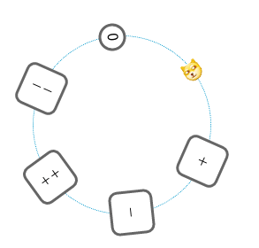
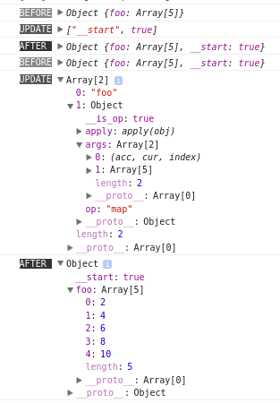
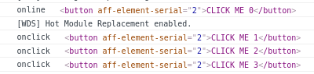
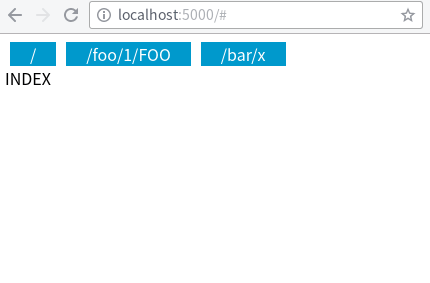

## 目录

* [框架理念](#0)
* [环境安装配置](#1)
* [基本用例：霓虹 Hello, world](#2)
* [html标签表示法一览](#3)
* [组件](#4)
* [App类](#5)
* [状态更新操作一览](#6)
* [跟踪状态变化](#7)
* [状态回滚与重放](#8)
* [默认及衍生状态](#9)
* [内联CSS样式](#15)
* [引用浏览器元素](#10)
* [路由](#11)
* [异步竞态问题](#12)
* [应对状态树结构变更](#13)
* [例子：todomvc 和 dbmon](#15)
* [小技巧集锦](#14)

<h2 id="0">框架理念</h2>

* 以函数为组件
* 内置状态管理
* 充分利用js自有的表达能力，无html模板或jsx
* 以观察者模式为核心结构，虚拟DOM、不变数据结构为优化手段
* 实现最小可用而正交的机制，方便融入现有的库、程序设计技巧及工程理念

bug、建议、提问等内容请在 issues 处发表，任何相关内容都可以。

<h2 id="1">环境安装配置</h2>

```bash
# 创建目录
mkdir guide
cd guide

# npm 初始化
npm init -y

# 安装模块
npm install --save-dev babel-core babel-loader babel-plugin-transform-object-rest-spread babel-preset-latest webpack webpack-dev-server affjs
```

webpack.config.js 配置文件
```js
module.exports = {
  entry: './main.js',
  output: {
    filename: 'bundle.js',
  },
  devtool: "source-map",
  devServer: {
    contentBase: __dirname,
    port: 5000,
  },
  module: {
    loaders: [
      {
        test: /\.js$/,
        exclude: /node_modules(?!\/affjs)/,
        loader: 'babel-loader',
      },
    ],
  },
}
```

.babelrc 配置文件
```json
{
 "presets": ["latest"], 
 "plugins": ["transform-object-rest-spread"],
}
```

index.html 入口 html
```html
<!doctype html>
<html>
  <head>
    <meta charset="utf-8">
    <meta name="viewport" content="width=device-width, initial-scale=1.0, maximum-scale=1.0, user-scalable=0">
  </head>
  <body>
    <div id="app"></div>
    <script src="bundle.js"></script>
  </body>
</html>
```

main.js 入口js
```js
import { patch } from 'affjs/dom'
import { p } from 'affjs/tags'

patch(
  document.getElementById('app'),
  p('Hello, world!')
);
```

启动 webpack 开发服务器
```bash
./node_modules/.bin/webpack-dev-server  --inline --hot --watch
```

如果编译无误，打开 http://localhost:5000/ 可看到 Hello, world!

<h2 id="2">基本用例：霓虹helloworld</h2>

```js
import { App } from 'affjs/app'
import { div, span } from 'affjs/tags'
import { $inc } from 'affjs/state'

let colors = [
  '#f26522',
  '#7fb80e',
  '#33a3dc',
  '#8552a1',
  '#ffe600',
  '#426ab3',
  '#d71345',
  '#00ae9d',
  '#ef5b9c',
];

// 初始状态，一个app使用唯一的对象保存所有状态
let init_state = {
  animation_tick: 0,
};

// 根组件，所有组件都表示为函数
let Main = (state) => div({
  // 样式定义，用一个object表示
  style: {
    fontSize: '32px',
  },
}, [
  // 字符串分解成单个字符，并构造span
  'Hello, world!'.split('').map((c, i) => {
    let color_index = state.animation_tick - i;
    let color = color_index < 0 ? 'transparent' : colors[color_index % colors.length];
    // 返回的span作为div的子元素
    return span({
      // 样式定义，也可以用string表示，下面使用的是es6的模板语法
      style: `
        color: ${color};
        text-shadow: 0 0 10px ${color}; 
      `,
    }, c);
  }),
]);

// 生成app
let app = new App(
  // 初始渲染的元素
  document.getElementById('app'),
  // 根组件
  Main,
  // 初始状态
  init_state,
);

setInterval(() => {
  // 更新状态，触发app重新渲染
  app.update('animation_tick', $inc);
}, 100);
```


<h2 id="3">html标签表示法一览</h2>

```js
import { div, p, button } from 'affjs/tags'

// 单个空标签
// <div></div>
div();
// <p></p>
p();

// 选择器
// <div id="main"></div>
div('#main'); 
// <div class="foo"></div>
div('.foo'); 
// <div class="foo bar baz"></div>
div('.foo .bar .baz'); 
// <div id="main" class="foo bar baz"></div>
div('#main .foo .bar. baz');

// 嵌套标签
// 使用 array 表示
// <div>
//   <div></div>
//   <div id="foo"></div>
//   <div>
//     <div class="bar"></div>
//   </div>
// </div>
div([
  div(),
  div('#foo'),
  div([
    div('.bar'),
  ]),
]);
// 如果只有一个子元素，可以直接嵌套
// <div>
//   <div>
//     <p></p>
//   </div>
// </div>
div(div(p()));
// 文本子元素，直接用字符串或数字表示，注意#或.开头的字符串会被认为是选择器
// <p>Hello, world!</p>
p('Hello, world!');
// <div><p>Hello, world!</p></div>
div(p('Hello, world!'));

// 属性
// id 和 class 的第二种表示法
// <div id="main" class="foo bar baz"></div>
div({
  id: 'main',
  class: 'foo bar baz',
});
// innerHTML
// <div><p>hello</p></div>
div({
  innerHTML: '<p>hello</p>',
});
// 样式
// <div style="color: black; font-size: 16px;"></div>
div({
  style: {
    color: 'black',
    fontSize: '16px',
  },
});
// 事件
button({
  onclick: () => {
    // ...
  },
});
button({
  onclick() {
    // ...
  }
});
// 其他key，都表示attr
// <div foo="FOO" bar="BAR"></div>
div({
  foo: 'FOO',
  bar: 'BAR',
});

// 两个参数，有几种组合
// 选择器 + 子元素
div('#main', [
  p('hello, world!'),
]);
// 选择器 + 属性
div('#main', {
  class: 'foo bar baz',
  style: {
    position: 'fixed',
  },
});
// 属性 + 子元素
div({
  id: 'main',
  onclick() {
    // ...
  },
}, [
  p('hello, world!'),
]);

// 三个参数，代表选择器 + 属性 + 子元素
div('#main', {
  class: 'container',
}, [
  p('hello'),
]);
```

<h2 id="4">组件</h2>

这个框架里的“组件”实际只是一个函数。这个函数返回的是，渲染视图所需要的信息。
根据不同的参数，组件函数可以返回不同的信息。
参数的变化就是状态的变化，组件函数将这些变化反映在视图里，达到状态与视图一致的目的。

一个组件函数，和它的实际参数，可以合称为一个thunk ([wikipedia: Thunk](https://en.wikipedia.org/wiki/Thunk))。
一个thunk是它的参数的“观察者”，它会观察各个参数，和前一个thunk的参数是否一样。
如果不一样，有某个参数发生了变化，它会调用组件函数，并传入参数，产生新的视图信息。
如果一样，它会假定视图信息没有发生变化，也就不需要调用组件函数。

所以thunk就是渲染优化的基本单位。框架除了会使用虚拟DOM的 diff / patch 算法减少浏览器DOM的创建，也会使用上述的手段，减少组件函数的调用。

前面的例子里，组件函数返回的都是html标签。实际上组件函数也可以返回一个thunk，thunk也可以作为html标签的子元素。thunk就像是一种自定义标签。

thunk 用 t 函数构造。第一个参数是组件函数，其余参数是将会传入组件函数的参数，示例：

```js
import { App } from 'affjs/app'
import { button, div, img } from 'affjs/tags'
import { t } from 'affjs/dom'
import { $inc, $dec } from 'affjs/state'

// 一个按钮组件，文字和点击事件都作为参数，从外部传入
let Button = (text, onclick) => button({
  onclick: onclick,
  style: `
    border: 3px solid #666;
    border-radius: 10px;
    background-color: white;
    width: 50px;
    height: 50px;
  `,
}, text);

// 一个布局组件，在圆周上均匀分布所有子元素
let Layout = (radius, base_degree, elems) => {
  return div({
    style: `
      width: ${radius * 2}px;
      height: ${radius * 2}px;
      border: 1px dotted #09C;
      border-radius: 50%;
      margin: ${radius / 2}px auto;
      position: relative;
    `,
  }, elems.map((elem, i) => {
    let degree = (i / elems.length * 360 + base_degree) % 360;
    let theta = 2 * 3.14 * (degree / 360);
    let x = radius * Math.cos(theta) + radius;
    let y = radius * Math.sin(theta) + radius;
    return div({
      style: `
        position: absolute;
        left: ${x}px;
        top: ${y}px;
        transform: translate(-50%, -50%) rotate(${degree}deg);
      `,
    }, elem);
  }));
};

// 初始化app
let app = new App(
  // 在这个元素处渲染
  document.getElementById('app'),
  // 初始状态
  {
    counter: 0,
    animation_tick: 0,
  },
);

// Main也是一个组件
// state参数是app当前的状态
let Main = (state) => {
  // 计数加一
  let inc = () => {
    app.update('counter', $inc);
  };
  // 计数减一
  let dec = () => {
    app.update('counter', $dec);
  };
  // 构造根组件
  return Layout(100, state.animation_tick % 360, [

    // 一个 Button 的 thunk
    t(Button, '＋', inc),
    // 另一个 thunk
    t(Button, '－', dec),

    // 不用thunk，直接调用Button也可以，但每次构造Main，都会直接调用
    // 而用thunk就只是生成一个对象，选择性地调用Button，可以优化渲染效率
    Button('＋＋', inc),
    Button('－－', dec),

    // 显示计数状态
    div({
      style: `
        border: 3px solid #666;
        display: inline-block;
        border-radius: 50%;
        width: 25px;
        height: 25px;
        text-align: center;
        background-color: white;
      `,
    }, state.counter),

    // 凑够6个元素
    img({src: 'http://img.t.sinajs.cn/t4/appstyle/expression/ext/normal/b6/doge_thumb.gif'}),

  ]);
};

// 继续初始化app，初始元素、初始状态、组件函数都设定好之后，app就开始渲染了
app.init(Main);

// 更新animation_tick，驱动动画
setInterval(() => {
  app.update('animation_tick', $inc);
}, 50);
```



如果觉得 thunk 这个概念不好理解，也没有关系，用就是了。
把一个组件函数的调用：Foo(arg1, arg2) 写成 thunk，只需要将 Foo 放入参数列表内，将调用的函数改成 t，就行了：t(Foo, arg1, arg2)。
框架会自动优化Foo的渲染，arg1和arg2有变化了，才重新调用Foo，更新界面。

<h2 id="5">App类</h2>

App类的构造函数会根据参数类型的不同，初始化不同的成员

* 如果类型为 HTMLElement，也就是浏览器DOM元素，会作为首次渲染所使用的元素
* 如果类型为函数，会作为根组件函数，每次重新渲染都会调用
* 其他类型都作为初始状态，一般为object类型

如果构造函数的参数没有提供所有这三种参数，则推迟首次渲染。
可以使用 init 方法继续初始化过程，对参数的处理和构造函数一样。
三种参数集齐后，App将开始渲染。

App类常用的方法及属性如下：

* update(...path, operation)，用于更新状态树
* tap(function(state))，用于读写状态树，如果传入的函数有返回值，返回值将传入update方法，更新状态树
* html()，返回根组件的innerHTML
* state，当前状态

<h2 id="6">状态更新操作一览</h2>

App类关联的状态树是一个普通的对象，但更新操作不能直接用赋值进行，且为了避免失误，会递归地调用Object.freeze冻结所有子对象。
为什么不能直接更新？因为更新操作需要保证原有的状态对象不变，所以是通过path-copying算法更新并构建一个新的状态对象。
另外状态更新之后，需要触发一次或者多次的组件及元素状态的更新，以及其它关联动作如beforeUpdate、afterUpdate等。
所以更新操作是统一由App类的update方法进行。

App的update方法的参数先是要改变的状态的路径，最后是改变的操作。

各种操作的示例如下：

```js
import { $inc, $dec, $merge, $push, $reduce, 
  $del_at, $map, $filter, $any } from 'affjs/state'
import { App } from 'affjs/app'
import { div } from 'affjs/tags'

let app = new App(
  document.getElementById('app'),
  () => div(),
  {},
);
let assert = console.assert;

// 赋值
app.update('number', 1);
assert(app.state.number == 1);
app.update('string', 'foo');
assert(app.state.string == 'foo');

// $inc 自增
app.update('number', $inc);
assert(app.state.number == 2);

// $dec 自减
app.update('number', $dec);
assert(app.state.number == 1);

// $merge 合并多个路径的操作
app.update($merge({
  'number': $inc,
  'string': 'FOO',
}));
assert(app.state.number == 2);
assert(app.state.string == 'FOO');

// $push array.push
app.update('array', [1, 2, 3]);
assert(app.state.array.length == 3);
app.update('array', $push(4));
assert(app.state.array.length == 4);

// $reduce object或array的reduce
app.update('array', $reduce((acc, cur, key) => {
  acc.push(cur * 2);
  return acc;
}, []));
assert(app.state.array[0] == 2);
assert(app.state.array[1] == 4);
assert(app.state.array[2] == 6);
assert(app.state.array[3] == 8);

// $del_at 删除array某个index的元素
app.update('array', $del_at(2));
assert(app.state.array.length == 3);
assert(app.state.array[0] == 2);
assert(app.state.array[1] == 4);
assert(app.state.array[2] == 8);

// $map array的map
app.update('array', $map(v => v / 2));
assert(app.state.array[0] == 1);
assert(app.state.array[1] == 2);
assert(app.state.array[2] == 4);

// $filter 对object和array，传入各个key和value，其他类型直接传入
app.update('array', $filter((value, i) => {
  return value <= 2;
}));
assert(app.state.array.length == 2);
assert(app.state.array[0] == 1);
assert(app.state.array[1] == 2);
app.update('number', $filter(n => n * 2));
assert(app.state.number, 4);

// $any 匹配所有路径，这是寻路用的，不是对状态的操作
app.update('array', $any, 42);
assert(app.state.array[0] == 42);
assert(app.state.array[1] == 42);

// 自定义操作，如果object的__is_op为真，即认为是一个操作，调用其apply成员实施操作
app.update('array', {
  __is_op: true,
  apply(obj) {
    return obj.map(x => x * 2);
  },
});
assert(app.state.array[0] == 84);
assert(app.state.array[1] == 84);
```

<h2 id="7">跟踪状态变化</h2>

继承App类，并覆盖beforeUpdate和afterUpdate方法，可以在状态更新前后，执行一些动作。
例如打印更新前后的状态，和更新操作的内容。这样可以方便地跟踪状态的变化，debug时可能用得上。

```js
import { App } from 'affjs/app'
import { div } from 'affjs/tags'
import { $map } from 'affjs/state'

class StateTracingApp extends App {
  constructor(...args) {
    super(...args);
  }

  // 将在状态更新前执行
  beforeUpdate(state, ...args) {
    console.log('%cBEFORE', 'background: #888; color: white', JSON.parse(JSON.stringify(state)));
    console.log('%cUPDATE', 'background: #555; color: white', args);
  }

  // 将在状态更新后执行
  afterUpdate(state, ...args) {
    console.log('%cAFTER ', 'background: #333; color: white', JSON.parse(JSON.stringify(state)));
  }
}

let init_state = {
  foo: [1, 2, 3, 4, 5],
};

let app = new StateTracingApp(
  document.getElementById('app'),
  () => div(),
  init_state,
);

// 更新状态
app.update('foo', $map(v => v * 2));
```



<h2 id="8">状态回滚与重放</h2>

因为状态树都是不变的数据结构，所以可以保存下某个时刻的状态，在需要时回滚。
或者记录一系列的状态，按照时间顺序重新置入App实例内，可用于debug中。
也可以保存子状态树，它们也是保持不变的。

例子如下：

```js
import { App } from 'affjs/app'
import { div, none } from 'affjs/tags'
import { $merge } from 'affjs/state'

let init_state = {
  r: 0,
  g: 0,
  b: 0,
};

// App的子类，增加snapshot方法
class AppWithSnapshot extends App {
  constructor(...args) {
    super(...args);
    this.snapshots = [];
  }

  snapshot() {
    // 将当前状态保存
    this.snapshots.push(this.state);
  }
}

// 半初始化，因为Main组件要用到app的方法，所以先生成
let app = new AppWithSnapshot(
  document.getElementById('app'),
  init_state,
);

function Main(state) {
  return div([
    // 点击时颜色随机变化的圆
    div({
      style: `
        background-color: rgb(${state.r}, ${state.g}, ${state.b});
        width: 100px;
        height: 100px;
        border-radius: 50%;
        margin: 0 auto;
      `,
      onclick() {
        // 更新前创建快照
        app.snapshot();
        // 随机颜色
        app.update($merge({
          r: Math.ceil(Math.random() * 255),
          g: Math.ceil(Math.random() * 255),
          b: Math.ceil(Math.random() * 255),
        }));
      },
    }),

    // 显示历史颜色，点击切换回历史状态
    // 这里用到的数据不在状态树内，但恰好创建snapshot后就更新了颜色状态，触发了重渲染
    div({
      style: `
        margin: 0 auto;
        text-align: center;
        margin-top: 20px;
        max-width: 150px;
      `,
    }, app.snapshots.map(snapshot => div({
      style: `
        background-color: rgb(${snapshot.r}, ${snapshot.g}, ${snapshot.b});
        width: 20px;
        height: 20px;
        border-radius: 50%;
        display: inline-block;
        margin: 0 5px;
      `,
      onclick() {
        // 直接将app的状态更新为历史状态
        app.update(snapshot);
      },
    }))),
  ]);
}

// 完成app的初始化
app.init(Main);
```


这个例子的目的并不是要实现这种交互，而是说明可以如何处理状态。
不变的数据结构在实现 "时间机器" 这种功能方面是十分容易的。

<h2 id="9">默认及衍生状态</h2>

设置默认状态，最简单的方法是写在 init_state 里：

```js
let init_state = {
  sort_by: 'timestamp',
};
```

或者写在组件函数里：

```js
let List = (state) => {
  if (!state.sort_by) {
    // 注意要将update方法的返回值赋值给state变量，不然state还是指向旧状态
    state = app.update('sort_by', 'timestamp');
  }
  return div();
};
```

衍生状态，指将某些状态通过一定运算得出的状态，可以在init_state里用getter实现：

```js
let init_state = {
  r: 0,
  g: 0,
  b: 0,
  // 在组件里可以用 state.rgb 获得计算出来的值
  get rgb() {
    return `rgb(${this.r}, ${this.g}, ${this.b})`;
  },
};
```

但上面的方法只适合计算量少的，因为每次更新状态，都新建一个对象，这些属性会被重新计算。
如果计算量很大，应该用下面的方法：

```js
function Main(state) {
  return div([

    // 一个命名 thunk，它的组件函数的参数是 r, g, b
    // 实参为 state.r, state.g, state.b
    // 所以如果这三个值发生了变化，这个组件会重新渲染，然后更新 state.rgb
    // 如果三个值没有变化，框架会认为这个组件不需要重新渲染，也就避免了重复计算
    // 这个thunk就相当于 state.r, state.g, state.b 的 observer
    // 注意thunk必须命名，否则框架没法判断是否相同，只能保守地认为不同，就每次都会触发计算了
    // thunk的命名可以通过第一个字符串参数，或者命名函数实现

    t('computed rgb', (r, g, b) => {
      app.update('rgb', `rgb(${r}, ${g}, ${b})`);
      return none;
    }, state.r, state.g, state.b),

    // ...
  ]);
}
```

上面实现的就是种观察者模式，组件并不作为视觉元素，而是观察状态树中的状态，并在它的值改变时触发一些动作。
这些动作中最常用的是，根据当前的状态，构建界面的视觉元素，所以组件函数的返回值被定义为新的元素。不需要改变视觉元素时，返回none就好了。

用这种模式可以实现很复杂的关联计算，衍生的状态本身也可以被其他衍生状态观察，而这些都是定义好，就不需要操心的了，框架会自动计算好。

patch的过程中，如果触发了状态更新，那patch完成后，会再次发起patch，直到状态达到稳定，不再变更为止。
因为不这样做的话，有些组件可能拿到的是update前的值，会造成界面显示和内部状态的不一致。

这也是这个框架不仅仅做视图层，而是加入状态管理的原因。
或者说，这个本来就是个状态管理的框架，界面组件只不过是状态的观察者，对状态的改变作出适当的反应。

<h2 id="15">内联CSS样式</h2>

从前面的例子可以看出，CSS样式都是写在标签内部的，渲染的时候渲染成标签的style属性。

这样做有很大的好处，下面将介绍一些例子。

<h3>响应式css / 适配分辨率</h3>

如果用css文件实现这个，要用到 media query，繁琐且散布在各处，修改不易。

```js
let screen_width = window.screen.width;

// 根据屏幕宽度，分成不同的类型
let screen;
if (screen_width <= 320) {
  screen = 'i5';
} else if (screen_width <= 375) {
  screen = 'i6';
} else if (screen_width <= 414) {
  screen = 'i6s';
}

let style = `
	// 根据屏幕类型取对象属性，如果类型不存在，就取默认值50
  margin-left: ${{
    i5: 20,
    i6: 30,
    i6s: 40,
  }[screen] || 50}px;
`;
```

<h3>css 样式 mixin</h3>

因为内联css样式可以是字符串或者对象，所以可以直接插入字符串到模板，或者合并对象的属性的方式，实现样式的混入。

这个看似和css的class相似，实际大有不同。因为可以混入函数调用的返回值，所以混入的样式，是可以参数化的。
这是js的表达能力优于原生css的例证。

例如一个可点击的区域，一般会定义cursor和user-select属性。可以把它做成一个可以复用的变量：

```js
// 字符串式
let clickable = `
	cursor: pointer;
	user-select: none;
`;

div({
	// 直接插入模板字符串内
	style: `
		${clickable}
		/* ... 其他样式 ... */
	`,
});

// 对象式
let clickable = {
	cursor: 'pointer',
	userSelect: 'none',
};
div({
	// 用 object spread 语法，合并入style对象
	style: {
		...clickable, 
		// 其他样式 ...
	},
});

```

另一个例子，绝对定位的样式，要写position、top、left等等，做成可复用的样式函数：

```js
let abs = (top, right, bottom, left) => {
  return `
    position: absolute;
    ${top === 0 || top ? 'top: ' + top + ';' : ''}
    ${right === 0 || right ? 'right: ' + right + ';' : ''}
    ${bottom === 0 || bottom ? 'bottom: ' + bottom + ';' : ''}
    ${left === 0 || left ? 'left: ' + left + ';' : ''}
  `;
};
```

然后在标签的style属性里就可以像下面这样用了，简洁了一些：

```js
div({
  style: `
    ${abs('30px', false, 0, false)}
  `,
});
```

上面的是字符串的例子，对象的例子原理一样，就不赘述了。
将常用或者共同的样式写成可混入的字符串或者函数，可以极大地使样式代码变得简洁。

<h3>css 伪类</h3>

标签的style属性是没办法表达伪类的。可以在旁边用一个style标签写：

```js
import { div, style } from 'affjs/tags'

div('.foo')
style(`
  .foo:hover {
    /* ... */
  }
`)
```

渲染出来，就是一个`<style></style>`，里面是css定义。
注意这样定义的样式的优先级比较低，所以如果标签里也有相同的定义，需要用!important才能使伪类的定义生效。

同理，上面的样式代码里也可以使用 ${} 插入任意的字符串。

<h2 id="10">引用浏览器元素</h2>

在元素事件回调中，可以用 this.element 引用渲染出来的浏览器元素。
在事件回调外、组件函数内，是拿不到元素的引用的，因为这个时候还没有创建元素。
可以添加 online 事件回调，会在元素创建后调用。

```js
import { App } from 'affjs/app'
import { div, button } from 'affjs/tags'
import { $inc } from 'affjs/state'

let app = new App(
  document.getElementById('app'),
  {
    count: 0,
  },
);

let Main = (state) => {
  return div([
    button({
      // 点击回调
      onclick() {
        console.log('onclick', this.element);
        app.update('count', $inc);
      },
      // 元素创建回调
      online(elem) {
        console.log('online', elem);
      },
    }, `CLICK ME ${state.count}`),
  ]);
};

app.init(Main);
```



注意到 online 回调只在元素创建时触发一次，后面框架对元素进行patch操作，改变文本的值，不会创建新元素，就不会再触发online事件。
这个主要用在和第三方库集成时，需要传递一个浏览器DOM做初始化的场景。

<h2 id="11">路由</h2>

这个框架并没有实现路由机制，因为和现有的路由库结合使用已经足够简单，不需要再做什么了。

以 riot-router 为例：

```js
import { App } from 'affjs/app'
import { div, a } from 'affjs/tags'
import { $merge } from 'affjs/state'
import route from 'riot-route';

// 子组件
let Index = () => div(`INDEX`);
let Foo = (a1, a2) => div(`FOO route args: ${a1} ${a2}`);
let Bar = (a1) => div(`BAR route args: ${a1}`);
let Baz = (a1, a2) => div(`BAZ route args: ${a1} ${a2}`);

// 根组件
let Main = (state) => {
  return div([
    // 几个路由切换链接
    [
      '/',
      '/foo/1/FOO',
      '/bar/x',
    ].map(url => a({
      style: `
        background-color: #09C;
        color: white;
        cursor: pointer;
        margin: 0 5px;
        padding: 0 20px;
      `,
      onclick() {
        route(url);
      },
    }, url)),

    // 根据当前路由key，返回不同的内容
    // 还可以直接将 Foo, Bar, Baz 等放入路由定义，可以少一处重复，但有时未必是一个key对应一个组件，牺牲一点DRY增加一点灵活性
    {
      index: Index,
      foo: Foo,
      bar: Bar,
      baz: Baz,
    }[state.route_key](...state.route_args),
  ]);
};

let app = new App(
  document.getElementById('app'),
  Main,
  {
    // 当前路由
    route_key: 'index',
    // 当前路由参数
    route_args: [],
  },
);

// 路由定义
let routes = {
  index: '/',
  foo: '/foo/*/*',
  bar: '/bar/*',
  baz: '/baz-*-*',
};
for (let key in routes) {
  route(routes[key], (...args) => {
    // 将key和参数放入状态树
    app.update($merge({
      route_key: key,
      route_args: args,
    }));
  });
}
// 首次访问时，执行一下路由
route.exec();
window.onhashchange = route.exec;
```



<h2 id="12">异步竞态问题</h2>

竞态发生在异步更新状态的时候，如果当前的一些状态和异步操作发起时不同，更新的结果就可能不是开发者预期中的了。

例如前面举的衍生状态的例子，如果衍生状态不是同步更新，而需要发起一次异步操作，操作返回之后再更新，那衍生状态就可能和当前状态不对应了。

又或者在异步返回时更新一个array中的元素，如果使用下标作为update路径，而列表在异步发起而未返回时更新了，那可能会更新了错误的元素。

解决办法有几种：

一是在异步操作返回，更新操作执行前，检查一下当前的状态，再决定是否更新。
例如异步衍生状态在更新前检查一下，依赖的状态是否发生了变化，如果变化了，就不更新，没有变化就更新。

二是设法使不同的异步操作更新不同的状态路径。还是衍生状态的例子，异步返回时，按照依赖的状态的不同，更新到不同的路径上。

三是避免使用列表下标作为更新路径，用元素的唯一标识。这样一个列表就需要一个 {} 和 []，各自保存元素状态和元素顺序。

<h2 id="13">应对状态树结构变更</h2>

在开发过程中，难免会遇到发现状态树设计不对，不得不更改的情况。

如果早期就能发现，那直接改掉所有相关的读写代码就可以了。
后期才发现的话，改起来就麻烦一些，甚至可能完全不敢动。

可以应用前面提到的观察者模式，将新旧路径的状态同步起来，然后在beforeUpdate钩子里检查一下更新的路径，如果发现旧路径，给出修复的提示，逐步迁移到新路径。

如果子组件间共享的状态不多，可以将根组件拆成几个app，各自管理状态，需要共享的状态，应用观察者模式，推送分发给其他app做同步。
这样虽然引入了状态同步的麻烦，但可以控制住app的规模，使其保持在可控的大小内。

也可以在一开始就引入 redux 的 action、reducer 等机制，将状态的写操作分成 dispatch 和 reduce 两部分。
这样状态树的变更就只影响到 reducer，组件 dispatch action 的代码不需要变动。
缺点就是写起来略繁琐。

还有其他封装写操作的方式，例如对某个路径的写操作，实现成一个 update 函数的 operation。
前面介绍更新操作的一节的最后有介绍，返回一个符合 update 接口的对象即可。
这样 update 的时候可以省略路径，修改路径也只需要修改 operation 的实现。

封装成 operation 而不是函数的原因是，统一用 app.update 这种调用方式，更容易跟踪，一眼就知道是状态更新的操作。
封装成函数，就没有这种直观性了。

对状态的读操作，因为并没有封装，就直接是读对象，所以只能手工改动了。或者在旧路径埋一个会抛异常的getter，有读操作就出错，提示需要修改。

之前考虑过整个状态树都转化为 getter-setter 的形式，每个结点记住自己在状态树的路径，这样不论传递到哪里，都可以通过直接赋值来更新。
读操作也可以插入钩子来做些什么。不过这种方式成本太大了，每次更新过程中，除了路径上的对象要重新创建，每个对象的每个属性都要重新调用一次Object.defineProperty。
而且这样全部属性都是 getter-setter 的对象，在浏览器 console 里显示时也不是很直观。于是作罢。

<h2 id="15">例子：todomvc 和 dbmon</h2>

[todomvc](http://todomvc.com/) 和 [dbmon](http://mathieuancelin.github.io/js-repaint-perfs/) 是各类前端框架实现得比较多的例子。
在 examples 目录下也有用本框架实现它们的示例代码：

todomvc: https://github.com/reusee/aff/blob/master/examples/todomvc/main.js

dbmon: https://github.com/reusee/aff/blob/master/examples/dbmon/main.js

和其他框架对比，代码行数属于比较少的一类，而且也不需要特别做什么优化。dbmon 的 fps，和优化版的 react、vue 处在同一水平。

<h2 id="14">小技巧集锦</h2>

<h3>开发环境和线上环境使用不同init_state</h3>

```js
let dev_state = {
  __env: 'dev',
};

let production_state = {
  __env: 'production',
};

let init_state = ['localhost', '127.0.0.1'].includes(window.location.hostname) ? dev_state : production_state;
```

<h3>用 local storage 保存状态</h3>

```js
let init_state = JSON.parse(window.localStorage.getItem('state')) || {
  // ...
};

function saveState() {
  window.localStorage.setItem('state', JSON.stringify(app.state));
  return false;
}

setInterval(saveState, 60000);
window.onbeforeunload = saveState;
// 或者其他适当的时机
```
