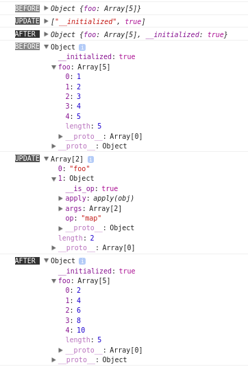

[](https://badge.fury.io/js/affjs)
[](https://travis-ci.org/reusee/aff)
[](https://coveralls.io/github/reusee/aff?branch=master)

## 目录

* [框架理念](#0)
* 上手指南
	* [环境安装配置](#1)
	* [基本用例：霓虹 Hello, world](#2)
	* [html 标签的表示法](#3)
	* [组件](#4)
	* [App类](#5)
	* [状态更新操作](#6)
	* [引用浏览器元素](#10)
	* [组件状态的逐层传递](#state-passing)
	* [状态对象的 $update 方法](#update)
* 进阶话题
	* [跟踪状态变化](#7)
	* [默认及衍生状态](#9)
	* [可复用的组件](#reusable)
	* [内联 css 样式技巧](#16)
	* [路由](#11)
	* [异步竞态问题](#12)
* 其他
	* [例子：todomvc 和 dbmon](#15)
	* [技巧集锦](#14)

<h2 id="0">框架理念</h2>

* 只以普通函数为组件
* 内置状态管理，使用全局单一状态树
* 利用 js 自有的表达能力，无 html 模板或 jsx
* 利用虚拟 DOM、观察者模式充分优化渲染过程
* 实现最小可用而正交的机制，方便融入现有的库、程序设计技巧及工程理念

bug、建议、提问等内容请在 issues 处发表，任何相关内容都可以。

<h2 id="1">环境安装配置</h2>

推荐使用的开发环境是 babel + webpack，下面将简单介绍安装及配置方法。
如果已经熟悉，可以跳过这部分。

如果不喜欢转译器或者构建工具，也可以直接用`<script>`标签引入，源码 lib 目录下是 UMD 格式的库文件。

```bash
# 创建目录
mkdir guide
cd guide

# npm 初始化
npm init -y

# 安装模块
npm install --save-dev babel-core babel-loader babel-plugin-transform-object-rest-spread babel-preset-latest webpack webpack-dev-server affjs
```

webpack.config.js 配置文件
```js
module.exports = {
  entry: './main.js',
  output: {
    filename: 'bundle.js',
  },
  devtool: "source-map",
  devServer: {
    contentBase: __dirname,
    port: 5000,
  },
  module: {
    loaders: [
      {
        test: /\.js$/,
        exclude: /node_modules(?!\/affjs)/,
        loader: 'babel-loader',
      },
    ],
  },
}
```

.babelrc 配置文件
```json
{
 "presets": ["latest"], 
 "plugins": ["transform-object-rest-spread"],
}
```

index.html 入口 html
```html
<!doctype html>
<html>
  <head>
    <meta charset="utf-8">
    <meta name="viewport" content="width=device-width, initial-scale=1.0, maximum-scale=1.0, user-scalable=0">
  </head>
  <body>
    <div id="app"></div>
    <script src="bundle.js"></script>
  </body>
</html>
```

main.js 入口js
```js
import { App, p } from 'affjs'

new App(
  document.getElementById('app'),
  {},
  () => p('Hello, world!'),
);
```

启动 webpack 开发服务器
```bash
./node_modules/.bin/webpack-dev-server  --inline --hot --watch
```

如果编译无误，打开 http://localhost:5000/ 可看到 Hello, world!

<h2 id="2">基本用例：霓虹helloworld</h2>

```js
import {
  App, css,
  div, span,
  $inc,
} from 'affjs'

const colors = [
  '#f26522', '#7fb80e', '#33a3dc', '#8552a1',
  '#ffe600', '#426ab3', '#d71345', '#00ae9d',
];

// 初始状态，一个app使用唯一的对象保存所有状态
const init_state = {
  animation_tick: 0,
};

// 根组件，所有组件都表示为函数
const Main = (state) => div(

  // 样式定义，使用 es6 的 tagged literal
  css` font-size: 32px; `,

  // 字符串分解成单个字符，并构造span
  'Hello, world!'.split('').map((c, i) => {
    const color_index = state.animation_tick - i;
    const color = color_index < 0 ? 
      'transparent' : colors[color_index % colors.length];
    // 返回的span作为div的子元素
    return span(c, css`
      color: ${color};
      text-shadow: 0 0 10px ${color}; 
    `);
  }),

);

// 生成app
const app = new App(
  // 初始渲染的元素
  document.getElementById('app'),
  // 根组件
  Main,
  // 初始状态
  init_state,
);

setInterval(() => {
  // 更新状态，触发app重新渲染
  app.update('animation_tick', $inc);
}, 100);


```


<h2 id="3">html 标签的表示法</h2>

这个框架没有使用 html 模板或者 jsx 来表示页面结构，而是使用 js 来表示。
下面举例说明表示 html 标签及其属性的各种方法。

<h3>基本表示</h3>

最简单的形式，例如一个没有任何属性或子标签的 div 标签，可以这样表示：

```js
import { div } from 'affjs'

div()
```

将标签名作为函数名调用就可以了。框架已经预先定义了所有 html 和 svg 的标签，直接 import 相应的标签名就能用了。

上面的 `div()` 相当于 `<div></div>`，其他标签同理。

除了全小写的名字外，也预定义了首字母为大写、全部字母为大写的函数，可以根据喜好选择不同风格：

```js
import { div, Div, DIV } from 'affjs'

div();
Div();
DIV();
```

如果需要框架预定义之外的标签名，可以用 e 函数：

```js
import { e } from 'affjs'

e('div');
```

作用和前面的是一样的，只不过标签名字作为第一个参数传入。

<h3>id 和 class</h3>

表示标签的 id 或者 class，有两种方式。

第一种是使用选择器：

```js
import { div, $ } from 'affjs'

div($`#the-div .class-a .class-b`)
```

标签函数传入了一个参数，这个参数是一个 es6 的 tagged template literal，也就是一个带有修饰函数的字符串。
这个修饰函数是 $，模板字符串的内容是一个选择器。标签则会被加上选择器所表示的 id 以及 class。

上面的表示法相当于：
```html
<div id="the-div" class="class-a class-b"></div>
```

从代码长度也可以看出，用 js 来表示，一般是比 html 要精简一些的。

另外一种表示方式是用一个属性对象：

```js
div({ id: 'the-div', class: 'class-a class-b' })
```

这种方式很容易理解，就是将标签的属性，表示成一个对象的属性就可以了。

另外 class 属性，除了可以用字符串表示，还可以用数组，或者一个对象来表示。

数组方式：
```js
div({ id: 'the-div', class: ['class-a', 'class-b'] })
```

就是将各个 class，写成数组的元素。

对象方式：
```js
div({ id: 'the-div', class: {
  ['class-a']: true,
  ['class-b']: true,
}})
```

class 作为对象的属性名，当属性值为真时，标签将加入这个 class，非真时不加入。

数组和对象的 class 表示法，在需要动态地增减标签的 class 时，比较方便，因为不需要手工去拼接字符串。

<h3>嵌套标签</h3>

标签可以嵌套，直接将子标签作为参数，传入父标签函数就可以了：

```js
import { p, span } from 'affjs'

p(span('Hello, '), span('world!'))
```

相当于：
```html
<p><span>Hello, </span><span>world</span></p>
```

其中 span 标签函数传入的是一个字符串参数，这个参数会被解析成一个文本元素。

也可以将子标签放入一个数组，再传递：

```js
p([span('Hello, '), span('world!')])
```

上面的代码，效果和前面是一样的，数组的元素都会被视作子标签。

实际上数组里还可以嵌套数组，框架解析的时候会将嵌套的数组平坦化 (flatten)：

```js
p([[[[[[span('Hello, ')]]]]], span('world!')])
```

上面的代码，表达的仍然是同样的结构。

只有嵌套的标签，才会形成嵌套的结构：

```js
p(span('Hello, ', span('world')))
```

上面的代码表示的结构就和前面的不同，表示的是：
```html
<p><span>Hello, <span>world</span></span></p>
```

类型为 boolean 和 number 的值，也和 string 类型的值一样，会被视为文本元素：

```js
ul(
  li(42),
  li(true),
)
```

相当于：
```html
<ul>
	<li>42</li>
	<li>true</li>
</ul>
```

类型为 function 的值，会被调用，以返回值作为嵌套的值：

```js
ul(
  () => span('hello, '),
  () => 'world!',
)
```

相当于：
```js
<ul><span>hello, </span>world!</ul>
```

同样的效果，也可以用 `(() => { ... })()` 实现。但能自动调用的话，写法就简单一些。

<h3>内联 css 样式</h3>

除了可以用 class 来对标签增加样式，还可以直接使用内联的样式。方法也有两种。

第一种和表示选择器的方式类似，用一个 tagged literal 的参数表示样式：

```js
import { css, p } from 'affjs'

p(css` color: blue; font-weight: bold `, 'Hello, world!')
```

使用的 tagged 函数为 css，内容是样式定义。

第二种方式是写在属性对象内：

```js
p('Hello, world!', {
  style: `
    color: blue;
    font-weight: bold;
  `,
})
```

和前面用属性对象表示标签的 id 和 class 的方式类似。属性名是 style。

另外使用属性对象方式定义时，style 属性值还可以使用对象：

```js
p('Hello, world!', {
  style: {
    color: 'blue',
    fontWeight: 'bold',
  },
})
```

样式名作为属性名，样式值作为属性值，样式值是字符串或者数字类型。可以根据喜好选择风格。

用 tagged literal 表示样式的好处是，里面可以使用 js 表达式：

```js
const color = '#09C';
const fontSize = 24;

p(css`
  color: ${color};
  font-size: ${fontSize}px;
`, 'Hello, world!')
```

模板字符串内的 ${} 表示一个 js 表达式。表达式可以是变量、运算、函数调用等等。
这是相当有用的，对 less、sass 等 css 预处理器的需求也会因此降低。

<h3>事件</h3>

标签的事件，可以用 on 函数来表示：

```js
import { button, input, on } from 'affjs'

button('CLICK ME', on('click', () => {
  console.log('clicked');
}))

input(on('change', () => {
  console.log('changed');
}))
```

或者写在一个表示属性的对象内，作为参数传入：

```js
button('CLICK ME', {
  onclick() {
    console.log('clicked');
  },
  ondblclick() {
    console.log('double clicked');
  },
})
```

用上面的方法，同类型的事件，只能设置一个。例如：

```js
import { App, button, on } from 'affjs'

new App(
  document.getElementById('app'),
  {},
  () => button(
    'CLICK ME',
    on('click', () => {
      console.log('foo');
    }),
    on('click', () => {
      console.log('bar');
    }),
  ),
);
```

点击这个按钮，只会输出 'bar'。输出 'foo' 的回调被覆盖了。

要想让一个事件响应多个回调，可以给事件增加一个子类型。子类型用 `:` 或者 `$` 隔开。例如：

```js
import { App, button, on } from 'affjs'

new App(
  document.getElementById('app'),
  {},
  () => button(
    'CLICK ME',
    on('click:foo', () => {
      console.log('foo');
    }),
    on('click:bar', () => {
      console.log('bar');
    }),
    {
      onclick$baz() {
        console.log('baz');
      },
    },
  ),
);
```

这样点击按钮时，三个回调都会调用，分别输出 'foo', 'bar', 'baz'。

如果不加子类型，默认子类型为 `__default`。也就是 `on('click', ...)` 相当于 `on('click:__default', ...)`。

这样设计的原因是，让事件处理代码变成声明式的，而不是让开发者过程式地手工处理事件 handler。

<h3>attribute 和 property</h3>

标签的 attributes 和 properties 是同时设置的，方法是将一个对象作为参数传入标签函数。
除了前面提到过的 id、class、style、以及 onxxx 等特殊属性名之外，这个对象的属性，会作为标签的属性设置。
例如：

```js
div({
  foo: 'FOO',
  bar: 'BAR',
})
```

等价于：
```html
<div foo="FOO" bar="BAR"></div>
```

有一些标签的 attribute 有对应的 property，例如 checkbox 的 checked、及按钮的 disabled 等，为了避免无谓的不一致，所以 attribute 和 property 是同时设置的。

<h3>标签函数的参数</h3>

如上所述，标签函数的参数可以没有，也可以是多个，参数是不定长的。
每个参数，都会根据上面所讲的规则进行解析，最终定义出这个标签的属性和行为。
每个参数的效果，是按顺序叠加的。

因此，对标签函数进行包装，就很方便。例如框架自带的 checkbox 标签，是这样定义的：

```js
const checkbox = (...args) => e('input', {
  type: 'checkbox',
}, ...args);
```

checkbox 函数的参数也是不定长的，但传递给 e 函数、构造 input 标签的时候，增加了一个指定 type 属性的参数。
这样在需要一个 type 为 checkbox 的 input 标签时，就可以直接用 checkbox 函数，而无需传入 type 属性给 input 标签。

有些框架也允许使用 hyperscript 或者其他方式手工构造渲染函数，但是它们的参数解析，不是基于对象属性，就是基于参数的位置。
无论在写法的简洁性，或者在封装的方便性，都有很大的缺陷。
可以是可以，但这些框架主流还是用 JSX 或者 html 模板，而不是纯 js 表达，设计者并没有花心思来让纯 js 的表达方式变好用。

<h2 id="4">组件</h2>

这个框架里的“组件”实际只是一个函数。这个函数返回的是，渲染视图所需要的信息。
根据不同的参数，组件函数可以返回不同的信息。
参数的变化就是状态的变化，组件函数将这些变化反映在视图里，达到状态与视图一致的目的。

一个组件函数，和它的实际参数，可以合称为一个thunk ([wikipedia: Thunk](https://en.wikipedia.org/wiki/Thunk))。
一个thunk是它的参数的“观察者”，它会观察各个参数，和前一个thunk的参数是否一样。
如果不一样，有某个参数发生了变化，它会调用组件函数，并传入参数，产生新的视图信息。
如果一样，它会假定视图信息没有发生变化，也就不需要调用组件函数。

所以thunk就是渲染优化的基本单位。框架除了会使用虚拟DOM的 diff / patch 算法减少浏览器DOM的创建，也会使用上述的手段，减少组件函数的调用。

前面的例子里，组件函数返回的都是html标签。实际上组件函数也可以返回一个thunk，thunk也可以作为html标签的子元素。thunk就像是一种自定义标签。

thunk 用 t 函数构造。第一个参数是组件函数，其余参数是将会传入组件函数的参数，示例：

```js
import {
  App, t, css, on,
  button, div, img,
  $inc, $dec,
} from 'affjs'

// 一个按钮组件，文字和点击事件都作为参数，从外部传入
const Button = (text, onclick) => button(
  text,
  on('click', onclick),
  css`
    border: 3px solid #666;
    border-radius: 10px;
    background-color: white;
    width: 50px;
    height: 50px;
    user-select: none;
  `,
);

// 一个布局组件，在圆周上均匀分布所有子元素
const Layout = (radius, base_degree, elems) => {
  return div(
    css`
      width: ${radius * 2}px;
      height: ${radius * 2}px;
      border: 1px dotted #09C;
      border-radius: 50%;
      margin: ${radius / 2}px auto;
      position: relative;
    `,
    elems.map((elem, i) => {
      const degree = (i / elems.length * 360 + base_degree) % 360;
      const theta = 2 * 3.14 * (degree / 360);
      const x = radius * Math.cos(theta) + radius;
      const y = radius * Math.sin(theta) + radius;
      return div(elem, css`
        position: absolute;
        left: ${x}px;
        top: ${y}px;
        transform: translate(-50%, -50%) rotate(${degree}deg);
      `);
    }),
  );
};

// 初始化app
const app = new App(
  // 在这个元素处渲染
  document.getElementById('app'),
  // 初始状态
  {
    counter: 0,
    animation_tick: 0,
  },
);

// Main也是一个组件
// state参数是app当前的状态
const Main = (state) => {
  // 计数加一
  const inc = () => {
    app.update('counter', $inc);
  };
  // 计数减一
  const dec = () => {
    app.update('counter', $dec);
  };
  // 构造根组件
  return Layout(100, state.animation_tick % 360, [

    // 一个 Button 的 thunk
    t(Button, '＋', inc),
    // 另一个 thunk
    t(Button, '－', dec),

    // 不用thunk，直接调用Button也可以，但每次构造Main，都会直接调用
    // 而用thunk就只是生成一个对象，选择性地调用Button，可以优化渲染效率
    Button('＋＋', inc),
    Button('－－', dec),

    // 显示计数状态
    div(state.counter, css`
      border: 3px solid #666;
      display: inline-block;
      border-radius: 50%;
      width: 25px;
      height: 25px;
      text-align: center;
      background-color: white;
    `),

    // 凑够6个元素
    img({src: 'http://img.t.sinajs.cn/t4/appstyle/expression/ext/normal/b6/doge_thumb.gif'}),

  ]);
};

// 继续初始化app，初始元素、初始状态、组件函数都设定好之后，app就开始渲染了
app.init(Main);

// 更新animation_tick，驱动动画
setInterval(() => {
  app.update('animation_tick', $inc);
}, 50);
```


<h2 id="5">App类</h2>

App类的构造函数会根据参数类型的不同，初始化不同的成员

* 如果类型为 HTMLElement，也就是浏览器DOM元素，会作为首次渲染所使用的元素
* 如果类型为函数，会作为根组件函数，每次重新渲染都会调用
* 其他类型都作为初始状态，一般为object类型

如果构造函数的参数没有提供所有这三种参数，则推迟首次渲染。
可以使用 init 方法继续初始化过程，对参数的处理和构造函数一样。
三种参数集齐后，App将开始渲染。

App类常用的方法及属性如下：

* update(...path, operation)，用于更新状态树
* html()，返回根组件的innerHTML
* state，当前状态

这个类虽然名为 "App"，实际是很轻量的，和其他框架里的有状态组件差不多。
但因为“组件”在这个框架里已经别有所指，只好命名为更重的东西。

所以一个页面其实可以有多个app。一个大系统可以按照功能拆分为多个app，各自管理状态。
在需要状态共享的场合，可以用观察者模式（后面衍生状态一节会讲到）推送状态到一个全局管理者，然后再分发给各个子app。

也可以在现有的页面里用这个框架实现一个或者几个部件。一个app只侵入一个浏览器元素，和页面其他部分不会有任何交集。

将App实例的 element 元素赋值为非真值，可以使它停止渲染：`app.element = undefined`。
后续仍然可以用 app.init 渲染到某一元素上。

<h2 id="6">状态更新操作</h2>

更新 App 实例所关联的状态，需要用 update 方法。
不能直接用赋值操作来更新，因为状态更新之后，框架需要重新检测各个组件依赖的状态，决定是否更新元素。
以及执行其他一些钩子函数等等。
直接用赋值操作，是不会触发这些动作的。

update 方法的参数，先是指定一个更新的路径，最后是要执行的操作。示例：

```js
import { App, div } from 'affjs'

const app = new App(
  // 初始状态
  {
    n: 0,
  },
  // 不要初始元素和根组件，也可以进行状态操作
);

// 路径为 'n'，用字符串表示属性名
// 最后一个参数为 1，表示更新该路径对应的属性值为 1
app.update('n', 1);
// 输出 1
console.log(app.state.n); 
```

嵌套的对象，用多个属性名字符串表示路径：

```js
import { App, div } from 'affjs'

const app = new App(
  {
    foo: {
      bar: {
        baz: 0,
      },
    },
  },
);

// 表示 app.state.foo.bar.baz 更改为 42
app.update('foo', 'bar', 'baz', 42);
// 输出 42
console.log(app.state.foo.bar.baz); 
```

同时更新多条路径，用 updateMulti 方法：

```js
import { App, div } from 'affjs'

const app = new App(
  {
    n: 0,
    foo: {
      bar: {
        baz: 0,
      },
    },
  },
);

// 更新多条路径，各个参数列表作为 array 传入
app.updateMulti(
  ['n', 1],
  ['foo', 'bar', 'baz', 42],
);
// 输出 1 和 42
console.log(app.state.n);
console.log(app.state.foo.bar.baz); 
```

路径也可以是一个函数，这个函数的参数是属性名，返回值如果为 true，表示匹配这个属性名对应的路径，为 false 表示不匹配。示例：

```js
import { App, div, $inc } from 'affjs'

const app = new App(
  // 初始状态为数组
  [1, 2, 3, 4, 5, 6, 7, 8],
);

app.update(
  // 匹配索引大于等于 2 的路径
  index => index >= 2,
  // 自增
  $inc,
);

// 输出 [1, 2, 4, 5, 6, 7, 8, 9]
// 索引大于等于 2 的元素，都 +1 了
console.log(app.state);
```

上面 update 调用的最后一个参数不是要更新的值，而是一个操作符。
$inc 这个操作符表示的是将数值的状态更新为 +1 的值。

除了 $inc，还有 $dec，表示 -1：

```js
import { App, div, $dec } from 'affjs'

const app = new App(
  [1, 2, 3, 4, 5, 6, 7, 8],
);

app.update(
  index => index >= 2,
  $dec,
);

// 输出 [1, 2, 2, 3, 4, 5, 6, 7]
console.log(app.state);
```

$func 操作符可以接受一个函数参数，状态将作为参数传入这个函数，这个函数的输出将作为更新值：

```js
import { App, div, $func } from 'affjs'

const app = new App(
  [1, 2, 3, 4, 5, 6, 7, 8],
);

app.update(
  index => index >= 2,
  $func(x => x * x),
);

// 输出 [1, 4, 9, 16, 25, 36, 49, 64]
console.log(app.state);
```

框架还提供了 Array 的一些方法：
* $push
* $unshift
* $splice
* $fill
* $sort
* $filter
* $map

上面这些操作符的参数和同名的 Array 方法是一样的。

下面这些 Array 操作符不需要参数：
* $pop
* $shift
* $reverse

另外还有 $delete 操作符，作用和 js 的 delete 操作符一样，参数是属性名。

<h2 id="10">引用浏览器元素</h2>

在元素事件回调中，可以用 this.element 引用渲染出来的浏览器元素。
在事件回调外、组件函数内，是拿不到元素的引用的，因为这个时候还没有创建元素。
可以添加 oncreated 事件回调，会在元素创建后调用。

```js
import {
  App,
  div, button,
  $inc,
} from 'affjs'

const app = new App(
  document.getElementById('app'),
  {
    count: 0,
  },
);

const Main = (state) => {
  return div([
    button({
      // 点击回调
      onclick() {
        console.log('onclick', this.element);
        app.update('count', $inc);
      },
      // 元素创建回调
      oncreated(elem) {
        console.log('oncreated', elem);
      },
    }, `CLICK ME ${state.count}`),
  ]);
};

app.init(Main);
```


注意 oncreated 回调只在元素创建时触发一次，后面框架对元素进行patch操作，改变文本的值，不会创建新元素，就不会再触发oncreated事件。
这个主要用在和第三方库集成时，需要传递一个浏览器DOM做初始化的场景。

如果需要在每次元素被patch的时候执行回调，可使用 onpatch / onpatched 事件。

还要注意的是，需要用到 this 的时候，回调函数不能用箭头函数 (即 () => {} 这样的)，因为箭头函数的 this 不能绑定，this.element 无效。

<h2 id="state-passing">组件状态的逐层传递</h2>

一个组件嵌套另一个组件，外层的组件可以称为父组件，内层的组件可以称为子组件。

子组件观察的状态，必须是父组件所观察的状态，或者它的子状态。
因为子组件的更新过程，从属于父组件的更新过程。父组件的更新，会因为它所观察的状态出现变化，而触发。
所以，如果子组件观察的状态，不属于父组件观察的状态的一部分，那就算子组件观察的状态发生了变化，子组件也不会触发更新。
因为父组件观察的状态，和子组件的没有关联，父组件没有触发更新，子组件自然不会更新。

也可以这样理解，父组件不需要更新的时候，子组件也不会更新。
在状态发生变化，需要检测哪些组件需要更新的时候，这样的策略对提高检测效率是很有益处的。

当然，这会给开发者带来一些麻烦。
在组件多重嵌套的场景下，叶子组件需要的状态，要逐层传递给它。例如：

```js
import { App, div, t } from 'affjs'

const init_state = {
  foo: 'FOO',
};

const app = new App(
  document.getElementById('app'),
  init_state,
);

const Element = (state) => div(state.foo);

const InnerWrapper = (state) => {
  return t(Element, {
    foo: state.foo,
  });
};

const Wrapper = (state) => {
  return t(InnerWrapper, {
    foo: state.foo,
  });
};

const OutterWrapper = (state) => {
  return t(Wrapper, {
    foo: state.foo,
  });
};

const Main = (state) => {
  return t(OutterWrapper, {
    foo: state.foo,
  });
};

app.init(Main);
```

Element 需要 foo 状态，所以要从 Main -> OutterWrapper -> Wrapper -> InnerWrapper -> Element 这样逐层传递。

Element 如果需要多一个状态，那就要改动多处代码，逐层增加。减少一个状态也是一样，需要改动多处。相当不便。

框架对这种情况，提供了一个解决办法。先看最终的代码：

```js
import { App, div, t } from 'affjs'

const init_state = {
  foo: 'FOO',
  OutterWrapper: {
    Wrapper: {
      InnerWrapper: {
        Element: {
          $use: ['foo'],
        }
      }
    },
  }
};

const app = new App(
  document.getElementById('app'),
  init_state,
);

const Element = (state) => div(state.foo);

const InnerWrapper = (state) => {
  return t(Element, state.Element);
};

const Wrapper = (state) => {
  return t(InnerWrapper, state.InnerWrapper);
};

const OutterWrapper = (state) => {
  return t(Wrapper, state.Wrapper);
};

const Main = (state) => {
  return t(OutterWrapper, state.OutterWrapper);
};

app.init(Main);
```

可以看出，传递给各个子组件的状态，定义在了 init_state 里。
而且这些子状态的属性名，都与组件名相同，表明这是一个将传递给相应组件的状态。
在传递的时候，直接传递相应的子状态就可以了。
组件树和状态树的结构相同，就可以有这个便利。
或者可以将这些子状态视作 "view model"。

另外，element 子状态里面有一个 $use 成员，这是框架提供的特殊机制。
它的意思是，向上寻找一个名为 foo 的状态，并逐层传递到这个状态对象里。
也就是说，OutterWrapper、Wrapper、InnerWrapper、Element 对应的这些状态对象，都会有一个 foo 属性，而且属性值和最外层的 foo 相同。
$use 指定的状态，是逐层传递的。

如果 Element 组件需要观察多一个状态，例如 bar，改动可以很少：

```js
const init_state = {
  foo: 'FOO',
  OutterWrapper: {
    bar: 'BAR', // 假设 bar 定义在这里
    Wrapper: {
      InnerWrapper: {
        Element: {
          $use: ['foo', 'bar'],
        }
      }
    },
  }
};
```

只需要改变 $use 的定义即可。删除同理，只需要改动一处，就可以完成逐层传递的目的。

$use 的定义也可以是一个对象，对象属性名对应设置的属性名，属性值对应需要查找的属性名：

```js
const init_state = {
  foo: 'FOO',
  OutterWrapper: {
    bar: 'BAR', 
    Wrapper: {
      InnerWrapper: {
        Element: {
          $use: {
            FOO: 'foo',
            BAR: 'bar',
          },
        }
      }
    },
  }
};

// ...

const Element = (state) => div(state.FOO, state.BAR);

```

这样 Element 组件里用到的就是 FOO 和 BAR，而不是 foo 和 bar 了。

$use 只会向上查找，直到根状态。如果到根状态都没有找到，就会抛出异常。
查找是初始化 App 的时候做的，不是在读取状态的时候。
所以从一开始就要在 init_state 里定义好相关的状态。

$use 的解析也只会在 App 初始化时做一次，后面 update 进状态树的不会解析。
因为解析 $use 标记开销比较大，如果更新一个大对象，就算不包含 $use 标记，也要进行解析的话，对性能影响比较大。

<h2 id="update">状态对象的 $update 方法</h2>

前面介绍了 App 类的 update 方法，这个方法的路径参数，是从根结点开始的绝对路径。
实际上状态树里每一个 object 类型的子状态，都会被加上 $update 方法。
$update 方法的作用和 App 类的 update 方法是一样的。
不同的是路径参数，子状态对象的这两个方法的路径参数，是以子对象在全局状态树中的路径，为根路径。

通过示例代码可能更容易理解：

```js
import { App } from 'affjs'

const app = new App({
  foo: {
    bar: {
      baz: {
        qux: 'QUX',
      },
    },
  },
});

// App 的 update 方法
app.update('foo', 'bar', 'baz', 'qux', 'new QUX');

// 子状态对象的 update 方法
const childState = app.state.foo.bar.baz;
childState.$update('qux', 'New QUX');
```

这个机制的作用是，让深层传递的状态，在更新的时候，可以不用管它在全局状态树中处于什么位置。
例如上面的代码里，更新 qux 的时候，不需要知道它前面的路径是 ['foo', 'bar', 'baz']。
因为 childState 这个对象，已经保存了这个路径的信息，直接调用 $update 方法，就会使用它保存的路径，放在前面作为完整的路径。

这个设计也使组件有了更好的可复用性。不论传入组件的子状态处于全局状态树的什么路径，更新的代码都是一样的。
传入不同路径的状态，不需要对组件代码进行改动。
也使得对全局状态的更新，就如更新本地状态一样方便了。

当然，如果组件需要更新的状态，不是传入组件函数的参数，那还是得用 App.update 方法去更新。

框架会将所有进入状态树的对象都加上 $update 方法。
这会带来一些开销。如果这些对象不需要更新，不需要这两个方法，可以用 readOnly 函数标记一下。
将对象作为参数传入即可，返回的对象会带上只读标记，框架不会为对象加上这两个方法。

另外，因为一个状态对象只会记录一个路径，所以一个对象的路径设定好之后，就不能变更了。
如果将一个已经设定了路径的对象，更新到状态树的其他路径，框架将会报错。
解决方法是避免在不同路径引用到同一个对象。或者在更新时使用 readOnly 函数标记该对象，这样就会跳过路径的检查。

<h2 id="7">跟踪状态变化</h2>

继承App类，并覆盖beforeUpdate和afterUpdate方法，可以在状态更新前后，执行一些动作。
例如打印更新前后的状态，和更新操作的内容。这样可以方便地跟踪状态的变化，debug时可能用得上。

```js
import {
  App,
  div,
  $map,
} from 'affjs'

class StateTracingApp extends App {
  constructor(...args) {
    super(...args);
  }

  // 将在状态更新前执行
  beforeUpdate(state, ...args) {
    console.log('%cBEFORE', 'background: #888; color: white', JSON.parse(JSON.stringify(state)));
    console.log('%cUPDATE', 'background: #555; color: white', args);
  }

  // 将在状态更新后执行
  afterUpdate(state, ...args) {
    console.log('%cAFTER ', 'background: #333; color: white', JSON.parse(JSON.stringify(state)));
  }
}

const init_state = {
  foo: [1, 2, 3, 4, 5],
};

const app = new StateTracingApp(
  document.getElementById('app'),
  () => div(),
  init_state,
);

// 更新状态
app.update('foo', $map(v => v * 2));
```



<h2 id="9">默认及衍生状态</h2>

设置默认状态，最简单的方法是写在 init_state 里：

```js
const init_state = {
  sort_by: 'timestamp',
};
```

或者写在组件函数里：

```js
const List = (state) => {
  if (!state.sort_by) {
    // 注意要将update方法的返回值赋值给state变量，不然state还是指向旧状态
    state = app.update('sort_by', 'timestamp');
  }
  return div();
};
```

衍生状态，指将某些状态通过一定运算得出的状态，可以在init_state里用getter实现：

```js
const init_state = {
  r: 0,
  g: 0,
  b: 0,
  // 在组件里可以用 state.rgb 获得计算出来的值
  get rgb() {
    return `rgb(${this.r}, ${this.g}, ${this.b})`;
  },
};
```

但上面的方法只适合计算量少的，如果计算量很大，应该用下面的方法：

```js
function Main(state) {
  return div([

		// 一个命名 thunk，它的组件函数的参数是 r, g, b
		// 实参为 state.r, state.g, state.b
		// 所以如果这三个值发生了变化，这个组件会重新渲染，然后更新 state.rgb
		// 如果三个值没有变化，框架会认为这个组件不需要重新渲染，也就避免了重复计算
		// 这个thunk就相当于 state.r, state.g, state.b 的 observer
		// 注意thunk必须命名，否则框架没法判断是否相同，只能保守地认为不同，就每次都会触发计算了
		// thunk的命名可以通过第一个字符串参数，或者命名函数实现
		// 因为不需要渲染元素，所以这个 thunk 的函数返回一个 null，表明不需要渲染的意思
		// 必须返回 null，不返回（即返回 undefined），会报错

    t('computed rgb', (r, g, b) => {
      app.update('rgb', `rgb(${r}, ${g}, ${b})`);
      return null;
    }, state.r, state.g, state.b),

    // ...
  ]);
}
```

上面实现的就是种观察者模式，组件并不作为视觉元素，而是观察状态树中的状态，并在它的值改变时触发一些动作。
这些动作中最常用的是，根据当前的状态，构建界面的视觉元素，所以组件函数的返回值被定义为新的元素。不需要改变视觉元素时，返回 null 即可。

用这种模式可以实现很复杂的关联计算，衍生的状态本身也可以被其他衍生状态观察，而这些都是定义好，就不需要操心的了，框架会自动计算好。

patch的过程中，如果触发了状态更新，那patch完成后，会再次发起patch，直到状态达到稳定，不再变更为止。
因为不这样做的话，有些组件可能拿到的是update前的值，会造成界面显示和内部状态的不一致。

这也是这个框架不仅仅做视图层，而是加入状态管理的原因。
或者说，这个本来就是个状态管理的框架，界面组件只不过是状态的观察者，对状态的改变作出适当的反应。

<h2 id="reusable">可复用的组件</h2>

前面讲述基础用法的章节，已经提到了各种有益于组件的可复用性的机制。
下面将用具体的例子说明组件如何复用。

<h3>同一组件用于不同的状态子树</h3>

```js
import {
  App, on, t, css, $any,
  div, ul, li, checkbox, span, button,
} from 'affjs'

const app = new App(document.getElementById('app'));

// 状态树
app.init({
  // 列表1
  list1: [
    { desc: 'task foo', done: false },
    { desc: 'task bar', done: true },
    { desc: 'task baz', done: false },
  ],

  // 列表2
  list2: [
    { desc: 'task FOO', done: true },
    { desc: 'task BAR', done: false },
    { desc: 'task BAZ', done: true },
  ],
});

// 组件
const TodoList = (list) => ul(
  // 列表
  list.map(item => li(
    // 是否完成
    checkbox(
      on('click', function() {
        item.$update('done', this.element.checked);
      }),
      {
        checked: item.done,
      },
    ),
    // 描述
    span(
      css`
        text-decoration: ${item.done ? 'line-through' : 'none'};
      `,
      item.desc,
    ),
  )),
  // 全部切换按钮
  button(on('click', () => {
    const allDone = list.reduce((acc, cur) => acc && cur.done, true);
    list.$update($any, 'done', !allDone);
  }), 'Toggle All'),
);

// 根组件
const Main = (state) => {
  return div(
    t(TodoList, state.list1),
    t(TodoList, state.list2),
  );
};

app.init(Main);
```


上面的 TodoList 就具备良好的可复用性。只需要将状态树中的任务列表传递给它，就可以正常工作。

而且状态更新，也只依赖传入的子状态，使用 $update 方法进行。不依赖任何全局对象。

<h3>同一组件用于不同 App 中</h3>

TodoList 组件因为不依赖任何外部对象，所以用于不同 App，传入不同状态树的子状态，都没有问题：

```js
import {
  App, on, t, css, $any, $,
  div, ul, li, checkbox, span, button,
} from 'affjs'

// 组件
const TodoList = (list) => ul(
  list.map(item => li(
    checkbox(
      on('click', function() {
        item.$update('done', this.element.checked);
      }),
      {
        checked: item.done,
      },
    ),
    span(
      css`
        text-decoration: ${item.done ? 'line-through' : 'none'};
      `,
      item.desc,
    ),
  )),
  button(on('click', () => {
    const allDone = list.reduce((acc, cur) => acc && cur.done, true);
    list.$update($any, 'done', !allDone);
  }), 'Toggle All'),
);

// 容器 app
const container = new App(
  document.getElementById('app'),
  {},
  () => div(
    div($`#app1`),
    div($`#app2`),
  ),
);

// App 1
const app1 = new App(
  container.element.querySelector('#app1'),
  // 列表1
  {
    todos: [
      { desc: 'task foo', done: false },
      { desc: 'task bar', done: true },
      { desc: 'task baz', done: false },
    ],
  },
  // 根组件
  (state) => div(
    t(TodoList, state.todos),
  ),
);

// App 2
const app2 = new App(
  container.element.querySelector('#app2'),
  // 列表2
  {
    todos: [
      { desc: 'task FOO', done: true },
      { desc: 'task BAR', done: false },
      { desc: 'task BAZ', done: true },
    ],
  },
  // 根组件
  (state) => div(
    t(TodoList, state.todos),
  ),
);
```

这段程序实现的交互，和上一节的是一样的。不同之处是 TodoList 组件被两个 App 使用。

由此可见，如果想让组件可以跨 App 复用，就不能依赖任何与特定 App 相关的对象。

有的框架，只使用组件的内部状态，也可以实现复用。但是牺牲掉的是全局状态树带来的便利。
TodoList 关联的状态处于全局唯一的状态树内，其他组件需要使用这些状态，直接使用就可以了。
不需要 TodoList 组件暴露出获取状态的接口。

<h2 id="16">内联 css 样式技巧</h2>

<h3>响应式css / 适配分辨率</h3>

如果用css文件实现这个，要用到 media query，繁琐且散布在各处，修改不易。

```js
const screen_width = window.screen.width;

// 根据屏幕宽度，分成不同的类型
let screen;
if (screen_width <= 320) {
  screen = 'i5';
} else if (screen_width <= 375) {
  screen = 'i6';
} else if (screen_width <= 414) {
  screen = 'i6s';
}

const style = `
	// 根据屏幕类型取对象属性，如果类型不存在，就取默认值50
  margin-left: ${{
    i5: 20,
    i6: 30,
    i6s: 40,
  }[screen] || 50}px;
`;
```

或者使用rem单位实现适配。

<h3>css 样式 mixin</h3>

因为内联css样式可以是字符串或者对象，所以可以直接插入字符串到模板，或者合并对象的属性的方式，实现样式的混入。

这个看似和css的class相似，实际大有不同。因为可以混入函数调用的返回值，所以混入的样式，是可以参数化的。
这是js的表达能力优于原生css的例证。

例如一个可点击的区域，一般会定义cursor和user-select属性。可以把它做成一个可以复用的变量：

```js
import { div, css } from 'affjs'

// 字符串式
const clickable = `
	cursor: pointer;
	user-select: none;
`;

div(css`
	// 直接插入模板字符串内
  ${clickable}
  /* ... 其他样式 ... */
`);

// 对象式
clickable = {
	cursor: 'pointer',
	userSelect: 'none',
};
div({
	// 用 object spread 语法，合并入style对象
	style: {
		...clickable, 
		// 其他样式 ...
	},
});
```

另一个例子，绝对定位的样式，要写position、top、left等等，做成可复用的样式函数：

```js
const abs = (top, right, bottom, left) => {
  return `
    position: absolute;
    ${top === 0 || top ? 'top: ' + top + ';' : ''}
    ${right === 0 || right ? 'right: ' + right + ';' : ''}
    ${bottom === 0 || bottom ? 'bottom: ' + bottom + ';' : ''}
    ${left === 0 || left ? 'left: ' + left + ';' : ''}
  `;
};
```

然后在标签的style属性里就可以像下面这样用了，简洁了一些：

```js
div(css`
	${abs('30px', false, 0, false)}
`);
```

上面的是字符串的例子，对象的例子原理一样，就不赘述了。
将常用或者共同的样式写成可混入的字符串或者函数，可以极大地使样式代码变得简洁。

<h3>css 伪类</h3>

标签的style属性是没办法表达伪类的。可以在旁边用一个style标签写：

```js
import { div, style } from 'affjs'

div('.foo')
style(`
  .foo:hover {
    /* ... */
  }
`)
```

渲染出来，就是一个`<style></style>`，里面是css定义。
注意这样定义的样式的优先级比较低，所以如果标签里也有相同的定义，需要用!important才能使伪类的定义生效。
如果不想使用 !important，可以将内联样式去掉，都写在 script 标签内。

同理，上面的样式代码里也可以使用 ${} 插入任意的字符串。

<h2 id="11">路由</h2>

这个框架并没有实现路由机制，因为和现有的路由库结合使用已经足够简单，不需要再做什么了。

以 riot-router 为例：

```js
import {
  App, css, on,
  div, a,
} from 'affjs'
import route from 'riot-route';

// 子组件
const Index = () => div(`INDEX`);
const Foo = (a1, a2) => div(`FOO route args: ${a1} ${a2}`);
const Bar = (a1) => div(`BAR route args: ${a1}`);
const Baz = (a1, a2) => div(`BAZ route args: ${a1} ${a2}`);

// 根组件
const Main = (state) => {
  return div([
    // 几个路由切换链接
    [
      '/',
      '/foo/1/FOO',
      '/bar/x',
    ].map(url => a(
      url,
      on('click', () => route(url)),
      css`
        background-color: #09C;
        color: white;
        cursor: pointer;
        margin: 0 5px;
        padding: 0 20px;
      `,
    )),

    // 根据当前路由key，返回不同的内容
    // 还可以直接将 Foo, Bar, Baz 等放入路由定义，可以少一处重复，但有时未必是一个key对应一个组件，牺牲一点DRY增加一点灵活性
    {
      index: Index,
      foo: Foo,
      bar: Bar,
      baz: Baz,
    }[state.route_key](...state.route_args),
  ]);
};

const app = new App(
  document.getElementById('app'),
  Main,
  {
    // 当前路由
    route_key: 'index',
    // 当前路由参数
    route_args: [],
  },
);

// 路由定义
const routes = {
  index: '/',
  foo: '/foo/*/*',
  bar: '/bar/*',
  baz: '/baz-*-*',
};
for (const key in routes) {
  route(routes[key], (...args) => {
    // 将key和参数放入状态树
		app.updateMulti(
			['route_key', key],
			['route_args', args],
		);
  });
}
// 首次访问时，执行一下路由
route.exec();
window.onhashchange = route.exec;
```


上面实现的是，一个路由对应到一个组件的方式。实际上并不是一定要这么死板。
URL 的改变引起状态树某些状态的改变，界面因而根据状态的改变而发生改变。
有时是整个界面全变，有时只是变一部分。其实没有必要模拟出传统的 web 系统的架构。
甚至“路由”这个概念都不是必要的。把 URL 所带的信息，看成是状态的一部分，URL 变了就是状态变了。
以状态管理的角度来看 URL 的改变，其实并没有什么需要框架特别处理的。

<h2 id="12">异步竞态问题</h2>

竞态发生在异步更新状态的时候，如果当前的一些状态和异步操作发起时不同，更新的结果就可能不是开发者预期中的了。

例如前面举的衍生状态的例子，如果衍生状态不是同步更新，而需要发起一次异步操作，操作返回之后再更新，那衍生状态就可能和当前状态不对应了。

又或者在异步返回时更新一个array中的元素，如果使用下标作为update路径，而列表在异步发起而未返回时更新了，那可能会更新了错误的元素。

解决办法有几种：

一是在异步操作返回，更新操作执行前，检查一下当前的状态，再决定是否更新。
例如异步衍生状态在更新前检查一下，依赖的状态是否发生了变化，如果变化了，就不更新，没有变化就更新。

二是设法使不同的异步操作更新不同的状态路径。还是衍生状态的例子，异步返回时，按照依赖的状态的不同，更新到不同的路径上。

三是避免使用列表下标作为更新路径，用元素的唯一标识。这样一个列表就需要一个 {} 和 []，各自保存元素状态和元素顺序。

<h2 id="15">例子：todomvc 和 dbmon</h2>

[todomvc](http://todomvc.com/) 和 [dbmon](http://mathieuancelin.github.io/js-repaint-perfs/) 是各类前端框架实现得比较多的例子。
在 examples 目录下也有用本框架实现它们的示例代码：

todomvc: https://github.com/reusee/aff/blob/master/examples/todomvc/main.js
* <a href="http://reusee.github.io/todomvc/index.html" target="_blank">todomvc 的在线 demo</a>

dbmon: https://github.com/reusee/aff/blob/master/examples/dbmon/main.js
* <a href="http://reusee.github.io/dbmon/index.html" target="_blank">dbmon 的在线 demo</a>

<h2 id="14">技巧集锦</h2>

<h3>开发环境和线上环境使用不同init_state</h3>

```js
const dev_state = {
  __env: 'dev',
};

const production_state = {
  __env: 'production',
};

const init_state = ['localhost', '127.0.0.1'].includes(window.location.hostname) ? dev_state : production_state;
```

<h3>用 local storage 保存状态</h3>

```js
const init_state = JSON.parse(window.localStorage.getItem('state')) || {
  // ...
};

function saveState() {
  window.localStorage.setItem('state', JSON.stringify(app.state));
  return false;
}

setInterval(saveState, 60000);
window.onbeforeunload = saveState;
// 或者其他适当的时机
```

注意，在代码里更改了 init_state，上面的代码仍然会载入local storage里的状态。
所以更改代码里定义的init_state后，需要手工清除local storage里的内容。
各浏览器的开发者工具都可以方便地做这个操作，或者在页面增加一个操作按钮。

<h3>在浏览器直接使用</h3>

lib 目录下的 affjs.js 是编译出来的 UMD 格式的库文件，可以直接用`<script>`标签引入并使用。例子：

```html
<!doctype html>
<html>
  <head>
    <meta charset="utf-8">
    <script src="affjs.js"></script>
  </head>
  <body>
    <div id="app"></div>
    <script>

var affjs = window.affjs;
var App = affjs.App;
var div = affjs.div;

var app = new App(
  document.getElementById('app'),
  {},
  function(state) {
    return div('Hello, world!');
  }
);

    </script>
  </body>
</html>
```

当然有些方便的语法特性，浏览器的 js 环境可能不支持。还是推荐使用转译器来写。
