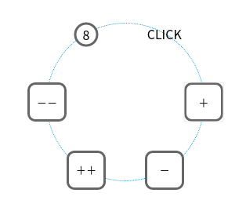

## 目录

[link](#环境安装配置)
[link](#基本用例：霓虹-Hello,-world)
[link](#html标签表示法一览)
[link](#组件)

## 环境安装配置

```bash
# 创建目录
mkdir guide
cd guide

# npm 初始化
npm init -y

# 安装模块
npm install --save-dev babel-core babel-loader babel-plugin-transform-object-rest-spread babel-preset-latest webpack webpack-dev-server affjs
```

webpack.config.js 配置文件
```js
module.exports = {
  entry: './main.js',
  output: {
    filename: 'bundle.js',
  },
  devtool: "source-map",
  devServer: {
    contentBase: __dirname,
    port: 5000,
  },
  module: {
    loaders: [
      {
        test: /\.js$/,
        exclude: /node_modules/,
        loader: 'babel-loader',
      },
    ],
  },
}
```

.babelrc 配置文件
```json
{
 "presets": ["latest"], 
 "plugins": ["transform-object-rest-spread"],
}
```

index.html 入口 html
```html
<!doctype html>
<html>
  <head>
    <meta charset="utf-8">
    <meta name="viewport" content="width=device-width, initial-scale=1.0, maximum-scale=1.0, user-scalable=0">
  </head>
  <body>
    <div id="app"></div>
    <script src="bundle.js"></script>
  </body>
</html>
```

main.js 入口js
```js
let {patch} = require('affjs').dom;
let {p} = require('affjs').tags;

patch(
  document.getElementById('app'),
  p('Hello, world!')
);
```

启动 webpack 开发服务器
```bash
./node_modules/.bin/webpack-dev-server  --inline --hot --watch
```

如果编译无误，打开 http://localhost:5000/ 可看到 Hello, world!

## 基本用例：霓虹 Hello, world
```js
let {
  tags: { div, span },
  app: { make_app },
  state: { $inc },
} = require('affjs');

let colors = [
  '#f26522',
  '#7fb80e',
  '#33a3dc',
  '#8552a1',
  '#ffe600',
  '#426ab3',
  '#d71345',
  '#00ae9d',
  '#ef5b9c',
];

// 初始状态，一个app使用唯一的对象保存所有状态
let init_state = {
  animation_tick: 0,
};

// App组件，所有组件都表示为函数
let App = (state) => div({
  // 样式定义
  style: {
    fontSize: '32px',
  },
}, [
  // 字符串分解成单个字符，并构造span
  'Hello, world!'.split('').map((c, i) => {
    let color_index = state.animation_tick - i;
    let color = color_index < 0 ? 'transparent' : colors[color_index % colors.length];
    // 返回的span作为div的子元素
    return span({
      style: {
        color: color,
        textShadow: '0 0 10px ' + color,
      },
    }, c);
  }),
]);

// 生成app
let app = make_app(
  // 初始渲染的元素
  document.getElementById('app'),
  // 根组件
  App,
  // 初始状态
  init_state,
);

setInterval(() => {
  // 更新状态，触发app重新渲染
  app.update('animation_tick', $inc);
}, 100);
```


## html标签表示法一览

```js
let {
  tags: { div, p, button },
} = require('affjs');

// 单个空标签
// <div></div>
div();
// <p></p>
p();

// 选择器
// <div id="main"></div>
div('#main'); 
// <div class="foo"></div>
div('.foo'); 
// <div class="foo bar baz"></div>
div('.foo .bar .baz'); 
// <div id="main" class="foo bar baz"></div>
div('#main .foo .bar. baz');

// 嵌套标签
// 使用 array 表示
// <div>
//   <div></div>
//   <div id="foo"></div>
//   <div>
//     <div class="bar"></div>
//   </div>
// </div>
div([
  div(),
  div('#foo'),
  div([
    div('.bar'),
  ]),
]);
// 如果只有一个子元素，可以直接嵌套
// <div>
//   <div>
//     <p></p>
//   </div>
// </div>
div(div(p()));
// 文本子元素，直接用字符串或数字表示，注意#或.开头的字符串会被认为是选择器
// <p>Hello, world!</p>
p('Hello, world!');
// <div><p>Hello, world!</p></div>
div(p('Hello, world!'));

// 属性
// id 和 class 的第二种表示法
// <div id="main" class="foo bar baz"></div>
div({
  id: 'main',
  class: 'foo bar baz',
});
// innerHTML
// <div><p>hello</p></div>
div({
  innerHTML: '<p>hello</p>',
});
// 样式
// <div style="color: black; font-size: 16px;"></div>
div({
  style: {
    color: 'black',
    fontSize: '16px',
  },
});
// 事件
button({
  onclick: () => {
    // ...
  },
});
button({
  onclick() {
    // ...
  }
});
// 其他key，都表示attr
// <div foo="FOO" bar="BAR"></div>
div({
  foo: 'FOO',
  bar: 'BAR',
});

// 两个参数，有几种组合
// 选择器 + 子元素
div('#main', [
  p('hello, world!');
]);
// 选择器 + 属性
div('#main', {
  class: 'foo bar baz',
  style: {
    position: 'fixed',
  },
});
// 属性 + 子元素
div({
  id: 'main',
  onclick() {
    // ...
  },
}, [
  p('hello, world!'),
]);

// 三个参数，代表选择器 + 属性 + 子元素
div('#main', {
  class: 'container',
}, [
  p('hello'),
]);
```

## 组件

组件是一个函数，这个函数构造一个标签并返回。
组件可以从外部传入状态，也就是外部状态可以作为函数的参数传入，返回的内容可以根据参数的不同而不同。

组件函数是一个纯函数，它的输出取决于它的输入。
一个组件函数，和它的输入，也就是一个实参列表，可以称为一个thunk（不知道这个术语有没有好的翻译？）。
thunk是渲染优化的基本单位，因为框架如果发现参数不变，那它的输出就不变，那就可以重新使用上一次函数的返回值，而不需要重新调用。
同理，如果发现参数改变了，组件函数会被重新调用，根据返回值再重新渲染界面。

组件函数也可以返回一个thunk。thunk可以作为标签的子元素。thunk就像一种自定义标签。

thunk 用 dom.t 函数构造。示例：

```js
let {
  dom: { t },
  tags: { button, div },
  app: { make_app },
  state: { $inc, $dec },
} = require('affjs');

// 一个按钮组件
let Button = (text, onclick) => button({
  onclick: onclick,
  style: {
    border: '3px solid #666',
    borderRadius: '5px',
    backgroundColor: 'white',
  },
}, text);

// App也是一个组件，它将被传入make_app函数并调用
// 调用的参数是内部的state，以及app的update函数
let App = (state, update) => {
  // 计数加一
  let inc = () => {
    update('counter', $inc);
  };
  // 计数减一
  let dec = () => {
    update('counter', $dec);
  };
  // 构造App
  return div([
    // 一个 Button 的 thunk
    t(Button, '++', inc),
    // 另一个 thunk
    t(Button, '--', dec),

    // 不用thunk，直接调用Button也可以，但App每次调用，都会调用Button，
    // 而用thunk就只是生成一个对象，可以优化渲染效率
    Button('++', inc),
    Button('--', dec),

    // 显示计数状态
    div(state.counter),
  ]);
};

let app = make_app(
  document.getElementById('app'),
  App,
  {
    counter: 0,
  },
);
```



# 未完待续
## app
## 状态
## 状态更新操作一览
## 跟踪状态变化
## 默认状态
## 衍生状态
## 引用浏览器元素
## 路由
## 单页多app结构
